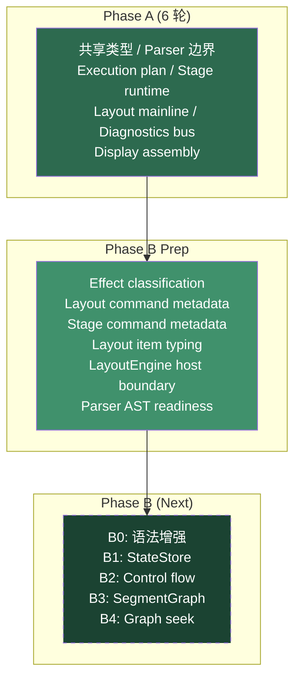

# Phase B Prep 代码审查报告

> 审查范围：Phase B Prep 全量增量（BP0–BP6），覆盖 effect/layout/stage metadata、layout item 类型收紧、LayoutEngine host 边界、parser AST 预留
> 对照参考：`docs/planning/roadmap/phase-a-refactor/phase-b-prep-refactor-plan.md`
> 审查时间：2026-05-07
> 复核状态：2026-05-10 接受审查结论；无阻塞项。仓库已更名为 `kmd`，仓库/目录规划另见 `docs/planning/ecosystem/repository-strategy.md`
> 验证状态：`vue-tsc -b` 通过，`pnpm build` 通过

---

## 一、结论摘要

Phase B Prep 完成了 7 个工作包（BP0–BP6）。变更集中在 **元信息补齐** 和 **host 边界收口** 两个方向，没有引入新的用户可见语法或删除 legacy 路径。23 个文件共 +974 / -76 行，风险可控。

**核心成果**：effect / layout / stage 三个 Manager/Preset 系统现在都有可被 middleware 消费的 typed metadata 入口。`LayoutEngine` 对 `readerApp` 的直连已通过 `LayoutHostView` 抽象收口。parser AST 为 B0 并发链、续行符、文本插值和 control-flow 行预留了 syntax-only 节点类型。

---

## 二、变更总览

| 类别 | 文件 | 行数 | WP |
|------|------|------|----|
| **新增：LayoutHostView** | `src/core/layout/LayoutHostView.ts` | 11 | BP4 |
| **新增：ReaderLayoutHostView** | `src/core/layout/ReaderLayoutHostView.ts` | 15 | BP4 |
| **新增：StageCommandMetadata types** | `src/core/stage/types.ts` | +29 | BP5 |
| **新增：stageCommandMetadata map** | `src/core/stage/stagePresets.ts` | +72 | BP5 |
| **新增：LayoutCommandMetadata types** | `src/core/layout/types.ts` | +44 | BP2/BP3 |
| **新增：layoutPresetMetadata** | `src/core/layout/layoutPresets.ts` | +118 | BP2 |
| **新增：layoutExpanderMetadata** | `src/core/layout/layoutExpanders.ts` | +101 | BP2 |
| **新增：EffectCommandClassification** | `src/core/effects/EffectProcessor.ts` | +111 | BP1 |
| **新增：Parser B0 AST nodes** | `src/core/parser/types.ts` | +46 | BP6 |
| **修改：LayoutManager** | metadata registry + query API | BP2 |
| **修改：StageRuntime** | metadata registry + query API | BP5 |
| **修改：StageManager** | metadata facade delegation | BP5 |
| **修改：LayoutPassRunner** | `any.charData` → typed `item.charData?.` | BP3 |
| **修改：LineAccumulator** | `(item as any).charData` → typed access | BP3 |
| **修改：LayoutEngine** | `readerApp` → `LayoutHostView` | BP4 |
| **修改：SegmentBuilder** | `MODIFIER_BASED_COMMANDS` → metadata query | BP5 |
| **修改：TextPlayer** | `MODIFIER_BASED_COMMANDS` → metadata query | BP5 |
| **修改：TextStageCueScheduler** | `MODIFIER_BASED_COMMANDS` → metadata query | BP5 |

---

## 三、逐 WP 评审

### BP0. Scope and Guard Rails ✅

验收方式正确：文档、TODO、README 都标记为"Phase B Prep"而非 Phase 7 或 Phase A 延续。`pnpm build` 和 `pnpm test:parser` 作为 gate。

### BP1. Effect Metadata and Processor Slimming Prep ✅

**新增 `EffectCommandClassification` 结构（~70 行类型 + `classifyCommand()`）**：

```typescript
export interface EffectCommandClassification {
  config: EffectConfig;
  lane: EffectCommandLane;        // layout | stage | style | effect | unknown
  track: EffectTrack | "stage" | "layout" | "unknown";
  isStyle: boolean;
  isLayout: boolean;
  isStage: boolean;
  participatesInStylePreview: boolean;
  defaultLevel?: CommandLevel;
  chainHint: EffectChainHint;     // group_sync | char_stagger | char_tween | container_only | graph_gate | unknown
}
```

**设计评价：方向正确，为 Phase B 的并发链和 graph gate 铺路。**

- `lane` 统一了之前散落在 `partition()` / `classifyByTrack()` / `getTrack()` 三处的 layout/stage/style/effect 判定
- `chainHint` 前置了 chain mode 推断，Phase B 的 `+` 并发链可以直接读 hint 决定独立 chain plan 分叉
- `participatesInStylePreview` 收口了 `shouldApplyAsInitialStyle()` 判定

**既有消费者已改为走 classification**：

| 方法 | 变化 |
|------|------|
| `classifyByTrack()` | 内部改为 `classifyCommand()` → `classified.track` |
| `partition()` | 内部改为 `classifyCommand()` → `classified.isLayout / isStage` |
| `getTrack()` | 委托 `classifyCommand()` |
| `applyInitialStylesToStyle()` | `styleManager.has()` → `shouldApplyAsInitialStyle()` |
| `applyInitialStylesToChar()` | 同上 |

> [!NOTE]
> **观察 1：`inferChainHint()` 的 `graph_gate` 分类包含了 layout 和 stage 两类命令。**
>
> ```typescript
> if (layoutManager.has(config.name) || (stageManager.has(config.name) && !effectManager.has(config.name))) {
>   return "graph_gate";
> }
> ```
>
> 语义上 `graph_gate` 暗示"此命令在 segment graph 边界有意义"。将 layout 命令也归为 `graph_gate` 是否准确？`goto` / `flow` 确实可能影响 segment 切割，但 `markStart` / `pushDisplayOffset` 不太可能。当前不影响运行时（hint 只是 metadata），但 Phase B 消费时需要细化。

> [!NOTE]
> **观察 2：`classifyCommand()` 每次调用都查询 4 个 Manager。**
>
> 在 `classifyByTrack()` 和 `partition()` 中，每个 config 会调用一次 `classifyCommand()`。如果 configs 列表较长，会有多次 Manager 查询。当前规模下不构成性能问题，但如果未来批量分类场景增多，可以考虑缓存或 batch classification。当前已提供 `classifyCommands()` 批量入口，只是内部仍是逐个分类。

### BP2. Layout Command Metadata ✅

**`LayoutCommandMetadata` 类型定义清晰：**

```typescript
export interface LayoutCommandMetadata {
  name: string;
  subsystem: "layout";
  phase: LayoutCommandPhase;        // "operator" | "expander"
  role: LayoutCommandRole;          // "anchor" | "cursor" | "flow" | "display-offset" | "internal"
  affectsFlow?: boolean;
  affectsDisplay?: boolean;
  writesMarkers?: boolean;
  readsMarkers?: boolean;
  internal?: boolean;
  description?: string;
}
```

**metadata 注册路径**：

```
layoutPresets.ts  → layoutPresetMetadata    → LayoutManager.registerMetadataBatch()
layoutExpanders.ts → layoutExpanderMetadata → LayoutManager.registerExpanderMetadataBatch()
```

**覆盖完整性确认**：

| Preset/Expander | metadata 已注册 |
|-----------------|:---:|
| `mark` (operator) | ✅ |
| `markStart` (operator + expander) | ✅ + ✅ |
| `markEnd` (operator + expander) | ✅ + ✅ |
| `goto` (operator + expander) | ✅ + ✅ |
| `offset` (operator + expander) | ✅ + ✅ |
| `left/right/up/down` (operator + expander) | ✅ + ✅ |
| `flow` (operator + expander) | ✅ + ✅ |
| `pushDisplayOffset` (operator) | ✅ |
| `popDisplayOffset` (operator) | ✅ |
| `markMiddle` (expander) | ✅ |
| `markChar` (expander) | ✅ |

**`LayoutManager.getMetadata()` 查询优先级**：expander → operator。这是合理的——expander 是面向用户的 token-scope 语义，operator 是内部生成的 layout-scope 语义。

**`satisfies LayoutCommandMetadataMap` 类型守卫**：metadata 对象在声明处即受类型约束，拼写错误会被 TypeScript 捕获。设计良好。

### BP3. Anchor and Layout Item Type Tightening ✅

**`LayoutGlyphPayload` 替代了原来的 `[key: string]: any`**：

```typescript
export interface LayoutGlyphPayload {
  char?: { text?: string; style?: { fontSize?: unknown } } | null;
  fontSize?: number;
  ascent?: number;
  descent?: number;
  [key: string]: any;  // 暂保留 index signature 兼容
}

export interface LayoutItem<TGlyph extends LayoutGlyphPayload = LayoutGlyphPayload> {
  isCommand?: false;
  width: number;
  height: number;
  charData?: TGlyph;
}
```

**`LayoutPassRunner` 中的 `any` 强转已消除**：

| 位置 | 旧 | 新 |
|------|-----|-----|
| `findFirstLineMaxAscent()` L38 | `(item as any).charData` | `item.charData?.char?.text` |
| `measureItem()` L116 | `(item as any).charData` | `item.charData?.char?.text` |
| `measureItem()` L118 | `(item as any).charData` | `item.charData?.fontSize ?? item.charData?.char?.style?.fontSize` |

**`LineAccumulator` 强转也已消除**：

```diff
- const { ascent, descent } = (result.item as any).charData;
+ const { ascent = 0, descent = 0 } = result.item.charData ?? {};
```

默认值 `= 0` 防止了 `charData` 为 `undefined` 时的 crash——这是一个正确的防御性改进。

**Reserved anchor 类型补齐**：

```typescript
export type ReservedAnchorScope = "prev" | "line" | "next";
export type ReservedAnchorPoint = "start" | "mid" | "end";
export type ReservedAnchorName = `${ReservedAnchorScope}.${ReservedAnchorPoint}`;
```

> [!NOTE]
> **观察 3：`LayoutGlyphPayload` 仍保留 `[key: string]: any` index signature。**
>
> 这是必要的过渡——现有 `LegacyCharData` 通过 `charData` 字段携带了 `effects`、`timingSugars`、`stageInstructions` 等额外字段。完全移除 index signature 需要先让所有消费者迁移到 typed access。当前保留是正确的兼容策略。

### BP4. LayoutEngine Host Boundary Prep ✅

**`LayoutHostView` 接口（11 行）**：

```typescript
export interface LayoutHostView {
  getScreenSize(): LayoutHostScreenSize;
  onUpdate(callback: () => void): void;
  onResize(callback: () => void): void;
}
```

**`ReaderLayoutHostView`（15 行）**：唯一的具体实现，封装 `readerApp.pixiApp` 的 screen/ticker/resize 访问。

**`LayoutEngine` 的 `readerApp` 直连收口确认**：

| 原直连 | 新路径 |
|--------|--------|
| `readerApp.pixiApp.screen.width` (init) | `this.hostView.getScreenSize().width` |
| `readerApp.pixiApp.screen.width` (recenterAll) | `this.hostView.getScreenSize().width` |
| `readerApp.pixiApp.screen.height` (update) | `this.hostView.getScreenSize().height` |
| `readerApp.pixiApp.screen.height` (scrollBy) | `this.hostView.getScreenSize().height` |
| `readerApp.pixiApp.ticker.add()` | `this.hostView.onUpdate()` |
| `readerApp.pixiApp.renderer.on("resize")` | `this.hostView.onResize()` |

> [!WARNING]
> **Finding #1 [Low]：`LayoutEngine` 仍在 `createLine()` 和 `appendLine()` 中保留 `stageManager.isFixedRatio` / `stageManager.designWidth` 直连。**
>
> 这些是 stage mode 下的 design-space 原点读取，不属于 scroll/reflow host 范畴。如果 Phase B 需要完全 headless 的 layout state，这些读取也需要通过 host 或 design metrics 接口抽象。当前只收口了 Pixi app 直连，stage metrics 的收口可推迟到 Phase B 的 graph bake 真正需要 headless layout 时。

> [!NOTE]
> **观察 4：`ReaderLayoutHostView.onUpdate()` 和 `onResize()` 不返回 unsubscribe。**
>
> 与 `StageHostSession` / `ReaderHost` 已有的 `() => void` 返回模式不一致。`LayoutEngine` 当前作为 singleton，生命周期与 app 一致，所以不构成泄漏风险。但如果未来需要支持 detach/reattach，需要补齐。

### BP5. Stage Preset Metadata ✅

**`StageCommandMetadata` 定义完整**：

```typescript
export interface StageCommandMetadata {
  name: string;
  kind: StageCommandKind;            // scene | camera | offset | modifier | playback
  propertyKey?: StagePropertyKey;     // camera.xy | camera.zoom | camera.rotation | ...
  modifierBased?: boolean;
  sceneLifecycle?: boolean;
  blockingDefault?: boolean;
  capturesTween?: boolean;
  description?: string;
}
```

**10 条 stage command metadata 已注册**（`scene.clear` / `cam.move` / `cam.zoom` / `cam.rotate` / `cam.focus` / `cam.offset` / `cam.reset` / `cam.shake` / `cam.drift` / `pause`），覆盖全部 `stagePresets` 注册的命令。

**`MODIFIER_BASED_COMMANDS` 已改为从 metadata 派生**：

```typescript
export const MODIFIER_BASED_COMMANDS = new Set(
  Object.entries(stageCommandMetadata)
    .filter(([, metadata]) => metadata.modifierBased)
    .map(([name]) => name)
);
```

**消费者迁移确认**：

| 消费者 | 旧 | 新 |
|--------|-----|-----|
| `SegmentBuilder.getStagePropertyKey()` | 硬编码 switch | `stageManager.getCommandMetadata(cmd)?.propertyKey` |
| `SegmentBuilder.applyStageConfigs()` | `MODIFIER_BASED_COMMANDS.has()` | `isModifierBasedStageCommand()` → metadata query |
| `TextPlayer` L350, L507 | `MODIFIER_BASED_COMMANDS.has()` | `stageManager.getCommandMetadata()?.modifierBased` |
| `TextStageCueScheduler` L39 | `MODIFIER_BASED_COMMANDS.has()` | `stageManager.getCommandMetadata()?.modifierBased` |

**`MODIFIER_BASED_COMMANDS` 的 import 已从 3 个消费文件中移除**（SegmentBuilder、TextPlayer、TextStageCueScheduler），它们现在全部通过 `stageManager.getCommandMetadata()` 查询。

> [!IMPORTANT]
> **关键验证：`SegmentBuilder.getStagePropertyKey()` 的 metadata 迁移安全性。**
>
> 旧代码硬编码了 `cam.move/cam.focus → "camera.xy"` 等映射。新代码读 `propertyKey`，且在函数内显式守卫了只接受 `camera.xy / camera.zoom / camera.rotation / offset.xy` 四个值。`cam.reset` 的 `propertyKey` 是 `"camera.reset"`——不在守卫列表中，所以 `getStagePropertyKey("cam.reset")` 返回 `null`。这与旧代码行为一致（旧代码的 switch default 也返回 `null`），`cam.reset` 的特殊处理在 `applyStageConfigs()` 的 `if (config.name === "cam.reset")` 分支中。✅ 安全。

### BP6. Parser Frontend B0 Readiness ✅

**新增 4 个 syntax-only AST 节点类型**：

| 类型 | 用途 |
|------|------|
| `ParallelCommandChainAst` | `+` 并发链：`branches: CommandChainExpressionAst[]` |
| `CommandChainExpressionAst` | 串行链表达式（包裹现有 `CommandChainAst[]`） |
| `TextInterpolationNodeAst` | `{var.xxx}` 文本插值 |
| `ControlFlowLineAst` | `@ if / @ else / @ endif / @ repeat / @ endrepeat` |

**`DocumentAst` 顶层 AST**：

```typescript
export interface DocumentAst {
  type: "document";
  metadata: KMDMetadata;
  paragraphs: ParagraphAst[];
  controlFlow: ControlFlowLineAst[];
  diagnostics: ParserDiagnostic[];
}
```

**`InlineNodeAst` union 已扩展**：

```typescript
export type InlineNodeAst =
  | TextNodeAst
  | TextInterpolationNodeAst  // ← 新增
  | GroupNodeAst
  | SugarNodeAst
  | PauseNodeAst;
```

**重要约束确认**：这些 AST 类型目前 **没有** 被任何 runtime lowering 路径消费。它们只是类型定义，为 B0 scanner/parser 实现预留形状。没有行为变更。

---

## 四、Findings 汇总

| # | 严重度 | 发现 | 建议 |
|---|--------|------|------|
| 1 | 🟢 Low | `LayoutEngine` 仍直连 `stageManager.isFixedRatio / designWidth` | Phase B graph bake 需要 headless 时收口 |
| 2 | 🟢 Low | `ReaderLayoutHostView.onUpdate/onResize` 不返回 unsubscribe | singleton 生命周期下无泄漏；需 detach 时补齐 |
| 3 | 🟢 Info | `LayoutGlyphPayload` 保留 `[key: string]: any` | 过渡期正确策略，待消费者迁移后收紧 |
| 4 | 🟢 Info | `inferChainHint()` 将所有 layout 命令归为 `graph_gate` | Phase B 消费时可能需要细化 |

**无阻塞级问题。** 所有 findings 都是延期型低风险项。

2026-05-10 复核补充：

- Finding #1 归入 Phase B graph bake / headless layout 边界，不在 Phase BP 返工。
- Finding #2 归入未来 `LayoutHostView` detach/reattach 生命周期增强；当前 singleton 生命周期可接受。
- Finding #4 归入 Phase B `EffectMiddleware` 消费 classification 时细化，不提前扩大 Phase BP。
- 仓库更名与 Android Reader 生态规划不改变 Phase BP 代码结论；相关目录策略以 `docs/planning/ecosystem/repository-strategy.md` 为准。

---

## 五、Phase A + BP 累计结构回顾



### Phase B Prep 为 Phase B 铺好的具体入口

| Phase B 需要 | Phase B Prep 提供 |
|-------------|------------------|
| `+` 并发链生成多条独立 chain plan | `EffectCommandClassification.chainHint` + `ParallelCommandChainAst` |
| `@ if / @ loop` 切割 segment 边界 | `ControlFlowLineAst` + `DocumentAst` |
| `{var.xxx}` 文本插值 | `TextInterpolationNodeAst` |
| Stage command conflict 前置到 StageMiddleware | `StageCommandMetadata.propertyKey / kind` |
| Layout command 能力查询（IDE / plugin） | `LayoutCommandMetadata` + `LayoutManager.getMetadata()` |
| Headless graph bake 不受 UI host 牵制 | `LayoutHostView` 抽象 |
| Layout stream item 类型安全 | `LayoutGlyphPayload` + typed `charData` |

---

## 六、总结

**Phase B Prep 完成了"不做功能，只补入口"的定位。** 7 个工作包全部落地，变更量适中（+974 行），没有引入行为变更或删除 legacy 路径。

核心成果：

1. **Effect classification 显式化** — lane / track / chainHint / stylePreview 四维分类，为并发链和 graph gate 做准备
2. **Layout/Stage command metadata** — 三个 Manager 都有 typed metadata 查询入口，`MODIFIER_BASED_COMMANDS` 从硬编码 Set 变为 metadata 派生
3. **Layout item 类型收紧** — `any.charData` 强转消除，`LayoutGlyphPayload` 提供最小结构化访问
4. **LayoutEngine host 收口** — `readerApp` 直连降为 `LayoutHostView` 抽象
5. **Parser AST 预留** — B0/B1/B2 的 syntax-only 形状已定义，不触及 runtime

**Phase B 可以从 B0（语法增强）或 B1（StateStore）开始，不再需要先解释旧 preset / processor 的隐式语义。**
