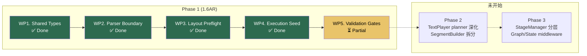

# Phase 1 (1.6AR) 第一轮重构代码审查

> 审查范围：未提交工作区变更（10 modified + 4 new files/dirs）
> 对照参考：`docs/planning/roadmap/phase-a-refactor/phase-1-implementation-plan.md` 的 4 个 WP

---

## 一、完成了什么

撰写者已完成 **WP1–WP4 全部四个工作包**，TODO 中 AR1–AR4 已全部勾选。`pnpm build`（vue-tsc）通过，零错误。

### 变更总览

| 类别 | 文件 | 行为 |
|------|------|------|
| **新增：共享类型** | `src/core/types/{cue,anchor,diagnostics,execution,layout,index}.ts` | WP1 — 6 个文件，定义了 `BaseCue`、`AnchorRef`、`ChainExecutionPlan`、`LayoutPreflightResult`、`DiagnosticEvent` 等 |
| **新增：ScopeRouter** | `src/core/parser/ScopeRouter.ts` (245 行) | WP2 — 从 `lowering.ts` 提取 scope routing 逻辑 |
| **新增：CompatProjector** | `src/core/parser/CompatProjector.ts` (44 行) | WP2 — 隔离 legacy `tokens/globalEffects` 投影 |
| **新增：Execution Plan** | `src/core/execution/paragraphExecutionPlan.ts` (84 行) | WP4 — `RuntimeParagraphExecutionPlan` 适配器 |
| **修改：lowering.ts** | -294 行 | WP2 — 大幅瘦身，scope routing + compat 逻辑移出 |
| **修改：commandCatalog.ts** | +113/-84 行 | WP2 — 引入 `CommandRegistryView` 接口 + 注入 |
| **修改：TextLayoutEngine.ts** | +144 行 | WP3 — phantom pass 升级为 `preflight()`，提取共享辅助函数 |
| **修改：TextPlayer.ts** | +40/-~20 行 | WP4 — `buildTimeline()` 改为消费 `RuntimeParagraphExecutionPlan` |
| **修改：ScriptPlayer.ts** | +4 行 | WP4 — 调用 `createParagraphExecutionPlan()` |
| **修改：Parser.ts / AstParser.ts / types.ts** | 穿线改动 | WP2 — `CommandRegistryView` 注入贯穿 |

### 净效果

```
lowering.ts:     461 → ~190 行（瘦身 59%）
TextLayoutEngine: 双 pass 共享逻辑从 ~200 行重复减少到共享 helper
TextPlayer:       从 (allChars, tokens) 原始参数转为 plan 消费
parser:           全链路支持 CommandRegistryView 注入
```

---

## 二、逐 WP 评审

### WP1. Shared Types Foundation ✅

**做得好的：**
- `BaseCue.id` 设为 `optional`（采纳了审查建议）
- `AnchorRef` 使用 discriminated union，与方案文档完全一致
- `LayoutPreflightResult` 使用泛型 `<TMarker = unknown>` 允许 layout 侧特化为 `CursorState`
- `DiagnosticEvent` 和 `AuditEvent` 完整定义，为跨层 diagnostics 预留了基础
- `ChainExecutionMode` 包含 `"graph_gate"` 为 Phase B 预留

**parser/types.ts 的类型统一手法值得肯定：**

```typescript
// 原来 parser 自己定义 SourceRange、DiagnosticSeverity
// 现在改为从共享类型 re-export
import type { DiagnosticEvent, DiagnosticSeverity, SourceRange } from "../types";
export type { DiagnosticSeverity, SourceRange };

// ParserDiagnostic 变为 extends DiagnosticEvent
export interface ParserDiagnostic extends DiagnosticEvent {
  line: number; // parser 侧强制要求 line
}
```

这样既保持了 parser 侧的使用习惯，又让诊断类型统一到共享层。

> [!NOTE]
> **一个小建议**：`layout/types.ts` 中的 type alias 方式略显冗余：
> ```typescript
> export type AnchorState = SharedAnchorState<CursorState>;
> export type LinePlan = SharedLinePlan;  // 这行没有特化，纯 alias
> ```
> `LinePlan` 没有泛型参数需要特化，直接 re-export 即可。不影响功能，但可以减少一层间接。

### WP2. Parser Boundary Extraction ✅

**ScopeRouter.ts — 提取质量优秀：**

这是本轮最大的结构性改动。245 行的 `ScopeRouter` 完整提取了：

- `applyLineCommands()` — 行级 `f.` / `.` / 裸名路由（L68-199）
- `applyBlockOptionCommands()` — 段落级 block option 路由（L201-244）
- 辅助函数：`toEffectConfig`、`toLayoutInstruction`、`cloneEffect`、`getVisualTargets`、`applyParagraphBroadcast`

与原 `lowering.ts` 对比，逻辑 1:1 保留，无行为变化。**这是教科书级的 Extract Module 重构。**

**CompatProjector.ts — 干净隔离：**

44 行的 `CompatProjector` 只做一件事：将 `ParagraphIR` 投影为 legacy `KMDParagraphData`。`inlineToLegacyToken()` + `projectParagraphToLegacyData()` 完全从 `lowering.ts` 中剥离。

现在 `lowering.ts` 的 `buildParagraphData()` 只需调用：
```typescript
return projectParagraphToLegacyData(ast, ir, diagnostics);
```

**CommandRegistryView — 依赖反转正确实施：**

```typescript
export interface CommandRegistryView {
  has(name: string): boolean;
  getFamily(name: string): CommandFamily;
  getMetadata(name: string): Record<string, unknown> | undefined;
}
```

- `createRuntimeCommandRegistryView()` 工厂函数封装了 4 个 Manager 的具体依赖
- `runtimeCommandRegistryView` 作为模块级默认实例提供向后兼容
- 所有 API（`resolveCommandFamily`、`getCommandSemanticInfo`、`attachCommandFamily`）都接受可选的 `registryView` 参数
- `KMDParser` 新增 `setCommandRegistryView()` 方法
- 注入贯穿 `Parser.ts → AstParser.ts → lowering.ts → ScopeRouter.ts` 全链路

> [!IMPORTANT]
> **审查发现 1**：`getCommandSemanticInfo()` 重构后改变了 `"unknown"` family 的处理顺序。
>
> 原来是 4 个 `if (family === ...)` 分支各自处理，最后兜底 `unknown`。
> 现在是先检查 `!registryView.has(name) || family === "unknown"` 提前返回，然后对 `layout` 和 `stage` 单独处理，最后用通用 metadata 查询处理 `style` 和 `effect`。
>
> 逻辑等价且更简洁，但合并了 `style` 和 `effect` 的分支。需要确认 `style` 的默认 `targetType` 设为 `"char"` 而 `effect` 设为 `"unknown"` 这个区别在新代码中是否保留——**看代码 L89：**
> ```typescript
> const targetType = (meta?.targetType ...) ?? (family === "style" ? "char" : "unknown");
> ```
> ✅ 是的，保留了。

> [!WARNING]
> **审查发现 2**：`resolveRuntimeCommandFamily()` 被保留为 legacy helper（L107-113），但它与 `createRuntimeCommandRegistryView().getFamily()` 是完全重复的实现。
> 如果没有外部调用方依赖这个函数名，建议在下一轮清理中移除。当前保留是安全的。

### WP3. Layout Preflight Formalization ✅

**核心改动：`runPhantomPass()` → `preflight()`**

- 从 `private static` 提升为 `public static`（允许外部消费 preflight 结果）
- 返回值从 `{ markers, writtenKeys }` 变为完整的 `LayoutPreflightResult`
- 新增 `LinePlan[]` 输出（每行的 baselineY、bounds、hasInFlow）
- 新增 `estimatedBounds` 输出（全局包围盒估算）
- 结果缓存在 `lastPreflightResult` 上（供 IDE/Inspector 查询）

**重复逻辑消除：**

两处关键的重复逻辑被提炼为共享 helper：

1. **`findFirstLineMaxAscent()`**（L31-39）— 原来在 phantom pass 和 calculate pass 中各写一次
2. **`applyLineAlignment()`**（L41-61）— 对齐校正逻辑原来在 phantom pass 末尾、calculate pass 换行处、calculate pass 末尾共 **3 处重复**，现在统一为一个函数

这直接消除了"改一个换行规则要改三处"的维护噩梦。

> [!TIP]
> **亮点**：`applyLineAlignment()` 接受可选的 `touchedMarkers` 和 `markers` 参数，使得 phantom pass（不需要 marker 修正）和 calculate pass（需要 marker 修正）可以共享同一个函数。这是一个精巧的设计。

### WP4. Execution Adapter Seed ✅

**`paragraphExecutionPlan.ts` — 适配器层：**

这是最有趣的新增。它不试图一次重写 TextPlayer 的内部逻辑，而是在 `ScriptPlayer` 和 `TextPlayer` 之间插入一个薄适配层：

1. `createParagraphExecutionPlan()` 从 `KineticChar[]` + `TokenWrapper[]` 组装 `RuntimeParagraphExecutionPlan`
2. `inferChainMode()` 将 `hold:char` 特例判断从 `TextPlayer.buildTimeline()` 前移到 plan 阶段
3. `toChainStep()` 将 `EffectConfig` 转换为 `BaseCue`

**TextPlayer.buildTimeline() 的改造：**

```typescript
// 旧签名
buildTimeline(target, allChars: KineticChar[], tokens: TokenWrapper[], options)

// 新签名  
buildTimeline(target, plan: RuntimeParagraphExecutionPlan, options)
```

内部改动：
- 从 `plan.items[i]` 读取 `char`、`isNewLine`、`tokenIdx`、`visualEffects`、`timingSugars`、`stageInstructions`
- 构建 `chainPlansByToken` Map 用于 token 边界时查询 chain mode
- `holdCharConfig` 判断从 `char.visualEffects.find(...)` 变为 **`chainPlan?.mode === "char_stagger" && holdCharConfig`**

> [!IMPORTANT]
> **审查发现 3 — 最关键**：`chainPlan?.mode === "char_stagger"` 条件是**新增的行为约束**。
>
> 原代码只检查 `holdCharConfig` 是否存在来决定走 `unrollCharChain` 还是 `unrollGroupChain`。新代码额外要求 `chainPlan?.mode === "char_stagger"`。
>
> 由于 `inferChainMode()` 的逻辑是 `effects.some(e => e.name === "hold" && e.level === "char")` → `"char_stagger"`，两个条件在正常路径下等价。但如果 `chainPlansByToken.get(item.tokenIdx)` 返回 `undefined`（即该 token 没有 chain plan），即使有 `holdCharConfig`，新代码也会走 `unrollGroupChain`。
>
> 这在什么情况下发生？当一个 token 的 `visualEffects` 非空但 `token.chars` 最后一个 char 的 `visualEffects` 为空时。这在当前代码中不太可能发生（因为 visual effects 总是挂在最后一个 char 上），但值得**加一个 assert 或 fallback 日志**确认无沉默回归。

**ScriptPlayer 改动极小（+4 行）：**

```typescript
const paragraphExecutionPlan = createParagraphExecutionPlan(kt._allCharsCached, kt.tokens);
const buildResult = TextPlayer.buildTimeline(kt, paragraphExecutionPlan, { speed: this.metadata.speed });
```

这是正确的 seam 插入——不改变 ScriptPlayer 的其他逻辑，只在 `buildTimeline` 调用前多一步 plan 组装。

---

## 三、当前所处阶段



**状态：Phase 1 的 WP1–WP4 代码已全部完成，WP5（验证门）部分完成。**

已通过：
- [x] `pnpm build`（vue-tsc 零错误）

未完成：
- [ ] `pnpm test:parser`
- [ ] 关键样例脚本回归检查

---

## 四、待处理项

| 优先级 | 项目 | 说明 |
|--------|------|------|
| 🔴 高 | 运行 `pnpm test:parser` | AR5 验证门尚未通过，需确认 parser 行为无回归 |
| 🔴 高 | 关键样例回归 | 至少跑 `public/tests/` 下的 12 个 fixture，确认 layout/timeline 无 silent regression |
| 🟡 中 | TextPlayer `char_stagger` 边界条件 | 审查发现 3 — 建议加 fallback log 确认无 chain plan 缺失 |
| 🟢 低 | `resolveRuntimeCommandFamily()` 清理 | 与 registryView.getFamily() 重复，可在下一轮删除 |
| 🟢 低 | `LinePlan` 纯 alias 简化 | `layout/types.ts` 中可直接 re-export |

---

## 五、总结

**撰写者做了一次质量很高的"骨架级重构"**。核心特点：

1. **严格遵循实施计划**——4 个 WP 按序完成，未越界到 Out of Scope
2. **零行为变化意图**——所有改动都是提取/包装/穿线，不改变 runtime 语义
3. **类型安全**——vue-tsc 零错误通过
4. **代码量净减**——`lowering.ts` 瘦身 59%，layout 双 pass 重复消除

Phase 1 的代码层面已就绪。下一步是跑通 AR5 验证门（test:parser + 样例回归），然后可以提交并准备进入 Phase 2。
