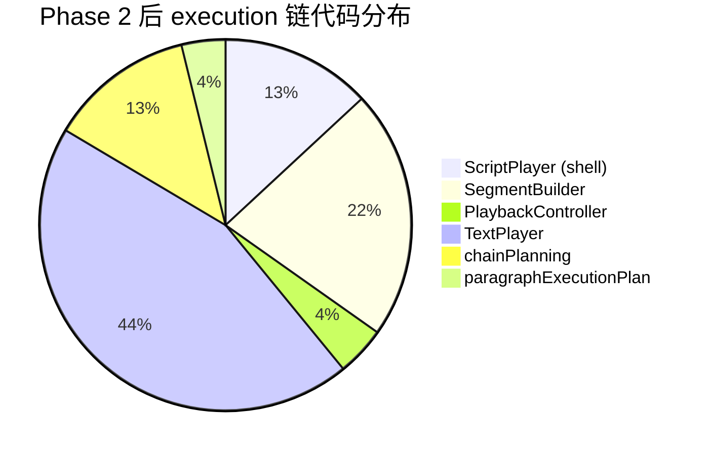

# Phase 2 (1.6AE) 代码审查报告

> 审查范围：Phase 1 基础上的增量变更（3 new modules + ScriptPlayer 重构 + TextPlayer/execution plan 深化）
> 对照参考：`docs/planning/roadmap/phase-a-refactor/phase-2-implementation-plan.md` 的 5 个 WP

---

## 一、完成了什么

Phase 2 的 **WP1–WP4 全部完成**。vue-tsc 零错误。用户已手动确认 parser 和样例测试无回归。

### 变更总览

| 类别 | 文件 | 行为 |
|------|------|------|
| **新增：chainPlanning.ts** | `src/core/execution/chainPlanning.ts` (265 行) | WP1+WP2 — lifecycle cue 生成、token plan 构建、chain mode 推断、pause:char 解析 |
| **新增：SegmentBuilder.ts** | `src/core/player/SegmentBuilder.ts` (455 行) | WP3 — 从 ScriptPlayer 完整提取 `buildSegment()` |
| **新增：PlaybackController.ts** | `src/core/player/PlaybackController.ts` (90 行) | WP4 — seek/replay/behavior 控制抽离 |
| **修改：paragraphExecutionPlan.ts** | 84→80 行（重构） | WP2 — 引入 lifecycle/cues，消费 chainPlanning |
| **修改：TextPlayer.ts** | +96/-~60 行 | WP1 — 消费 tokenPlan/lifecycle，消除热路径推断 |
| **修改：ScriptPlayer.ts** | 773→274 行（**-64.5%**） | WP3+WP4 — 委托 SegmentBuilder + PlaybackController |
| **新增：phase-2-implementation-plan.md** | 278 行 | 第二阶段实施文档 |

### 净效果

```
ScriptPlayer.ts:    773 → 274 行（瘦身 64.5%，从"大总管"变为 orchestration shell）
TextPlayer:         消除 3 类热路径推断（pauseChar 检测、token 边界扫描、deferred stage 收集）
execution/:         从 1 文件 84 行 → 2 文件 345 行（真正的 planner 层）
```

---

## 二、逐 WP 评审

### WP1. TextPlayer Planner Deepening ✅

**消除的热路径推断：**

| 原来的推断 | 改为 |
|-----------|------|
| `char.isNewLine \|\| char.text === "\\n"` | `item.lifecycle.isLineBreak` |
| `i === 0 \|\| !prevChar \|\| prevChar.tokenIdx !== char.tokenIdx`（token 边界扫描） | `item.lifecycle.isTokenStart` / `item.lifecycle.isTokenEnd` |
| token 内遍历找 lastInToken + pauseChar 检测（~15 行循环） | `tokenPlan?.pauseCharOverride`（plan 预计算） |
| `char.visualEffects`（直读 KineticChar 私有字段） | `tokenPlan.visualEffects`（从 plan 读取） |
| `deferredStageInstrs` 运行时收集 | `tokenPlan.tokenEndStageInstructions`（plan 预收集） |

**新增的 diagnostics：**

```typescript
private static reportPlanDiagnostics(plan) {
  for (const diagnostic of plan.diagnostics ?? []) { /* console.warn/error/info */ }
}

private static warnMissingChainPlan(tokenIdx, line?) {
  console.warn(`[ExecutionPlan] Missing chain plan for token ${tokenIdx}; ...`);
}
```

这两个方法直接回应了 Phase 1 审查发现 3（`char_stagger` 边界条件需要 fallback 日志）。

**`char_stagger` 守卫升级：**

```typescript
// Phase 1: chainPlan?.mode === "char_stagger" && holdCharConfig
// Phase 2: holdCharConfig && (!chainPlan || chainPlan.mode === "char_stagger")
if (holdCharConfig && (!chainPlan || chainPlan.mode === "char_stagger")) {
  if (!chainPlan) {
    this.warnMissingChainPlan(item.tokenIdx, item.line);  // ← 显式告警
  }
  this.unrollCharChain(...);
}
```

与 Phase 1 相比，现在 `holdCharConfig` 存在但 `chainPlan` 缺失时**不会静默退化**——它会发出 warning 然后走 char_stagger fallback。这比 Phase 1 的行为更安全。

### WP2. ParagraphExecutionPlan Enrichment ✅

**核心新增：`chainPlanning.ts`（265 行）**

这是 Phase 2 最重要的新模块。它正式确立了 3 层 plan 结构：

```
ParagraphExecutionItem（per-char 粒度）
  ├─ lifecycle: ParagraphExecutionLifecycle
  ├─ cues: BaseCue[]
  └─ timingSugars / stageInstructions / visualEffects

ParagraphExecutionTokenPlan（per-token 粒度）
  ├─ chainPlan?: ChainExecutionPlan
  ├─ pauseCharOverride
  ├─ tokenEndStageInstructions
  └─ cues: BaseCue[]（token 内全部 item cues 的 flatMap）

RuntimeParagraphExecutionPlan（per-paragraph 粒度）
  ├─ items: ParagraphExecutionItem[]
  ├─ tokenPlans: ParagraphExecutionTokenPlan[]
  ├─ chainPlans: ChainExecutionPlan[]
  └─ diagnostics: DiagnosticEvent[]
```

**lifecycle cue 的正式命名化：**

```typescript
// chainPlanning.ts — createGeneratedLifecycleCue()
function createGeneratedLifecycleCue(kind: LifecycleAnchor, tokenIdx, sourceOrigin): BaseCue {
  return {
    family: "lifecycle",
    kind,              // "paragraph_start" | "token_end" | "line_break" | ...
    origin: "generated",
    anchor: kind,
    target: tokenIdx >= 0 ? { kind: "token", tokenIndex: tokenIdx } : undefined,
    sourceOrigin,
  };
}
```

这直接落实了 execution-refactor-outline 中"未命名 cue 的收集"要求。5 种 lifecycle cue 现在都是正式的 `BaseCue` 实体，而不是 `TextPlayer` 中的匿名 if/else 分支。

**`collectItemCues()` — 将 timing sugar 和 stage instructions 也 cue 化：**

```typescript
export function collectItemCues(lifecycle, tokenIdx, line?, timingSugars?, stageInstructions?): BaseCue[] {
  // lifecycle cues (generated)
  // timing sugar cues (lowered playback)
  // stage instruction cues (lowered stage)
}
```

**`buildTokenPlan()` — 集中 token 级语义判断：**

- `inferChainMode()` → `chainPlan.mode`
- `resolvePauseCharOverride()` → `pauseCharOverride`
- token-end stage instructions 的预收集
- `hold:char` vs `char_stagger` 的 diagnostics（L238-248）

> [!TIP]
> **亮点：hold:char diagnostics**
> ```typescript
> if (hasHoldCharEffect && (!chainPlan || chainPlan.mode !== "char_stagger")) {
>   diagnostics.push({
>     severity: "warning",
>     code: "execution.missing_char_stagger_plan",
>     message: `Token ${token.tokenIdx} contains hold:char timing but did not resolve to char_stagger plan.`,
>     ...
>   });
> }
> ```
> 这正是第二轮审查建议的"不允许静默退化"。plan 阶段和消费阶段各有一道守卫。

### WP3. SegmentBuilder Extraction ✅

**455 行的 `SegmentBuilder` 完整提取了 `ScriptPlayer.buildSegment()` 的全部逻辑：**

| 方法 | 职责 | 行数 |
|------|------|------|
| `build()` | 主 orchestration：paragraph 循环、timeline 装配、checkpoint 收集 | ~180 行 |
| `createParagraphText()` | paragraph 实例化 | ~15 行 |
| `placeParagraph()` | paragraph placement（遵循"保持内部"建议） | ~35 行 |
| `applyStageConfigs()` | stage 指令处理 + 冲突裁切 | ~80 行 |
| `captureTween()` | tween 捕获 | ~5 行 |
| `trimActiveStageTween()` (module-level) | stage tween 裁切 | ~30 行 |
| `extractTweenTargets()` / `getStagePropertyKey()` (module-level) | 辅助函数 | ~25 行 |

**关键设计决策：**

1. **`SegmentBuildContext` 接口**（L27-34）— builder 不直接引用 ScriptPlayer，而是接受一个明确的 context 对象。这使 SegmentBuilder 在不触碰 play/pause/seek 的情况下可以独立测试。

2. **`PlaybackRuntimeState` 的穿透**（L33）— context 包含 `playbackState: PlaybackRuntimeState`，builder 在 behavior 回调中写入 `playbackState.activeBehaviorCleanups`。这是一个共享可变状态。

3. **`placeParagraph()` 保持为 `private static`**（L324-358）— 遵循审查建议，不提前独立 coordinator。

> [!WARNING]
> **审查发现 1：`SegmentBuildContext` 的 `metadata: any` 类型过于宽泛。**
>
> ```typescript
> export interface SegmentBuildContext {
>   container: Container;
>   metadata: any;         // ← 应该至少有 { speed: number; maxWidth?: number }
>   paragraphs: KMDParagraphData[];
>   ...
> }
> ```
>
> 当前 `metadata` 被读取 `metadata.speed`（L172）和 `metadata.maxWidth`（L314），但类型是 `any`。建议至少定义 `{ speed: number; maxWidth?: number; [key: string]: any }` 或引用现有的 `KMDMetadata` 类型。不影响功能但损害类型安全。

> [!NOTE]
> **审查发现 2：`SegmentBuilder.build()` 仍使用 `useEditorStore()` 获取 store。**
>
> L104 和 L273-275 直接 import 了 Vue store。对于一个旨在"可独立测试"的 builder，store 依赖最好通过 context 注入而非直接 import。当前不阻碍功能，但会阻碍 headless 测试。可以延后处理。

### WP4. PlaybackController Extraction ✅

**90 行的 `PlaybackController` 干净提取了 4 个职责：**

| 方法 | 职责 |
|------|------|
| `playSegment()` | 播放/重启 |
| `pauseSegment()` | 暂停 |
| `seekToTime()` | 跳转 + behavior 重注册 + style 重放 |
| `clearBehaviors()` | 清理 behavior cleanups |
| `registerBehaviors()` (private) | behavior 按时间点重注册 |
| `replayStyles()` (private) | style 按时间点 reset + 重放 |

**`PlaybackRuntimeState` 接口：**

```typescript
export interface PlaybackRuntimeState {
  isAutoPlaying: boolean;
  activeBehaviorCleanups: BehaviorCleanup[];
}
```

这是 `ScriptPlayer`、`SegmentBuilder`、`PlaybackController` 三者的共享状态载体。ScriptPlayer 持有实例，通过参数传递给其他两个模块。

**ScriptPlayer 的消费方式：**

```typescript
// 原来：this.isAutoPlaying = true; this.activeBehaviorCleanups = [];
// 现在：
public playSegment() {
  PlaybackController.playSegment(this.segment, this.playbackState);
}
public seekToTime(seconds: number) {
  PlaybackController.seekToTime(this.segment, seconds, this.playbackState);
}
```

> [!NOTE]
> **审查发现 3：PlaybackController 中 `seekToTime()` 仍直接调用 `useEditorStore()` (L48)。**
>
> 与 SegmentBuilder 同类问题。store 更新可以返回到 ScriptPlayer 做，而非在 controller 内部 import。低优先级。

### ScriptPlayer 瘦身效果

```
Before: 773 行（load + buildSegment + play/pause/seek + behaviors + styles + placement + stage + tween）
After:  274 行（load + orchestration shell + 委托 SegmentBuilder/PlaybackController）
Delta:  -499 行（-64.5%）
```

剩余的 274 行只负责：
- 脚本加载与解析（`loadScript`）
- Segment build 的委托调用（`buildSegment` → `SegmentBuilder.build()`）
- Playback 的委托 facade（`playSegment`/`pauseSegment`/`seekToTime` → `PlaybackController.*`）
- 段落跳转（`goToParagraph`/`advance`）
- 清理与 getter（`stop`/`autoPlay`/`toggleAutoPlay`）

---

## 三、交叉分析

### Phase 2 与 Phase 1 审查建议的对齐

| Phase 1 审查建议 | Phase 2 落地 |
|-----------------|-------------|
| `char_stagger` 边界加 fallback log | ✅ `warnMissingChainPlan()` + plan 阶段 `execution.missing_char_stagger_plan` diagnostics |
| `ParagraphPlacementCoordinator` 合并到 SegmentBuilder | ✅ `placeParagraph()` 保持为 `SegmentBuilder` 的 `private static` 方法 |
| `trimActiveStageTween` 保留为函数而非类 | ✅ module-level 函数，未升级为类 |
| lifecycle cue 命名化 | ✅ `createGeneratedLifecycleCue()` 产出正式 `BaseCue` |
| TextPlayer 不再依赖 `hold:char` 命令名特判 | ✅ 改为 `chainPlan.mode === "char_stagger"` |

### 代码量分布变化



从"770 行 ScriptPlayer + 800 行 TextPlayer"的双巨头，变为 6 个模块，最大单模块是 `TextPlayer`（931 行，但其中 buildTimeline 的核心循环已大幅依赖 plan 输入）。

---

## 四、审查发现汇总

| # | 严重度 | 发现 | 建议 |
|---|--------|------|------|
| 1 | 🟡 中 | `SegmentBuildContext.metadata: any` 类型过宽 | 至少定义 `{ speed: number; maxWidth?: number }` |
| 2 | 🟢 低 | `SegmentBuilder.build()` 直接 import `useEditorStore()` | 通过 context 注入，方便 headless 测试 |
| 3 | 🟢 低 | `PlaybackController.seekToTime()` 直接 import `useEditorStore()` | store 更新可返回给调用方 |
| 4 | 🟢 低 | `chainPlanning.ts` 中 `toCueAnchor()` 是恒等函数 | 当前是类型占位符，无实际变换；如果短期内不扩展可内联 |

> [!TIP]
> 发现 2 和 3 本质上是同一个问题——新模块还没有完全脱离 Vue store 的直接依赖。不阻碍当前功能和测试，但在 Phase B 引入 headless/worker 运行时之前需要处理。建议统一用 `context.onStoreUpdate?.()` 回调模式。

---

## 五、与实施计划的完成度对照

| WP | 验收标准 | 状态 |
|----|---------|------|
| WP1 | `buildTimeline()` 不再依赖 `hold:char` 命令名特判 | ✅ 改为 plan mode |
| WP1 | `char_stagger` 缺 plan 时有显式 fallback diagnostics | ✅ 双重守卫 |
| WP1 | 至少一类 lifecycle/chain mode 判断被 plan 替代 | ✅ 3 类已替代 |
| WP2 | `TextPlayer` 不再回退到 `KineticChar` 私有字段猜语义 | ✅ 改读 `item.lifecycle` / `tokenPlan.*` |
| WP2 | `ParagraphExecutionPlan` 可区分 authored/lowered/generated cue | ✅ `BaseCue.origin` 字段已使用 |
| WP3 | `ScriptPlayer` 不再直接持有大段 buildSegment 逻辑 | ✅ 委托 `SegmentBuilder.build()` |
| WP3 | `SegmentBuilder` 可独立测试（不触碰 play/pause/seek） | ⚠️ 基本可行但有 store 依赖 |
| WP3 | paragraph placement 已内聚在 SegmentBuilder 内部 | ✅ `private static placeParagraph()` |
| WP4 | ScriptPlayer 职责清晰分三层 | ✅ load / build / playback |
| WP5 | `pnpm build` | ✅ vue-tsc 零错误 |
| WP5 | `pnpm test:parser` | ✅ 用户手动确认通过 |
| WP5 | 关键样例脚本回归 | ✅ 用户手动确认通过 |

---

## 六、总结

**Phase 2 是一次高质量的结构性拆分。** 核心特点：

1. **`chainPlanning.ts` 是本轮最有价值的产出**——它将 `TextPlayer` 中散落的 5 类热路径推断统一收口到一个 265 行的 planner 模块，正式引入了 lifecycle cue、token plan、chain plan 三层结构
2. **ScriptPlayer 瘦身 64.5%**，从"大总管"变为清晰的三层委托 shell（load / build / playback）
3. **零行为回归意图**——所有拆分都是 Extract Module，未改变 runtime 语义
4. **审查建议全部落地**——Phase 1 的 `char_stagger` 守卫、lifecycle 命名化、placeParagraph 保持内部等 5 条建议均已实施

Phase 1+2 合计，execution 主链路的重构已完成。接下来的自然方向是：
- `StageManager` 分层（ReaderHost / PresentationManager / StageRuntime）
- `DocumentSemanticIR` / `ControlFlowMiddleware` 的真正落地
- Phase B graph / state / control-flow 功能开发
