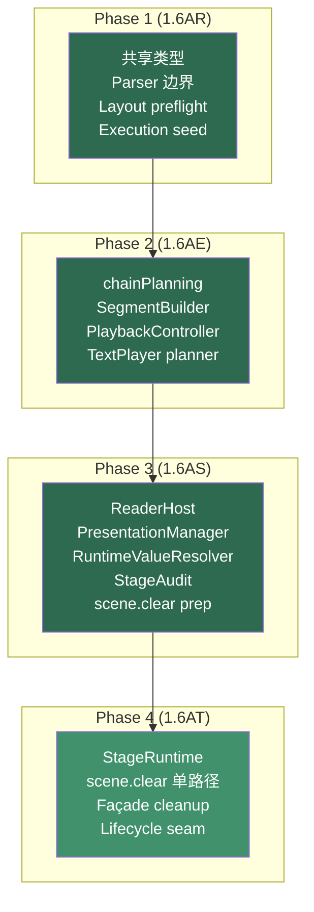

# Phase 4 (1.6AT) 代码审查报告

> 审查范围：Phase 3 (staged) 基础上的增量变更（2 new files + StageManager/SegmentBuilder/stagePresets/ReaderHost 重构）
> 对照参考：`docs/planning/roadmap/phase-a-refactor/phase-4-implementation-plan.md` 的 5 个 WP

---

## 一、完成了什么

Phase 4 的 **AT1–AT5 已全部完成**。`pnpm build`、`pnpm test:parser` 与样例脚本人工回归均已通过。

### 变更总览

| 类别 | 文件 | 行为 |
|------|------|------|
| **新增：StageRuntime** | `src/core/stage/StageRuntime.ts` (161 行) | AT1 — camera/cameraOffset/buildMode/registry/apply/modifiers 全部切出 |
| **新增：StageRuntimeInstance** | `src/core/stage/StageRuntimeInstance.ts` (10 行) | AT1 — runtime 单例工厂 + 默认 audit port |
| **修改：StageManager.ts** | 308→282 行 | AT3 — 收缩为 façade/composition root |
| **修改：stagePresets.ts** | ~82 行改动 | AT1 — 全量从 `stageManager` 迁移到 `stageRuntime` |
| **修改：SegmentBuilder.ts** | ~160 行重构 | AT2 — scene.clear 单路径迁移 |
| **修改：ReaderHost.ts** | +4 行 | AT4 — onResize/addTicker 返回 unsubscribe |

### 净效果

```
StageManager.ts:   308 → 282 行（运行时执行面全部委托，保留 façade + host + presentation）
StageRuntime.ts:   0 → 161 行（真正的 stage runtime owner）
stagePresets.ts:   全量 stageManager.* → stageRuntime.*
SegmentBuilder:    scene.clear 从"双路径"变为"单路径 runtime hook"
ReaderHost:        lifecycle seam 补齐（detach 能力）
```

---

## 二、逐 WP 评审

### AT1. StageRuntime Extraction ✅

**`StageRuntime` (161 行) 的职责边界干净：**

| 职责 | 方法 |
|------|------|
| Camera 状态 | `camera`, `cameraOffset`, `buildMode`, `getSnapshot()`, `restoreState()` |
| 命令注册 | `register()`, `registerBatch()`, `has()` |
| 命令执行 | `apply()`（含参数预解析 + 审计记录） |
| 修饰器 | `addModifier()`, `removeModifier()`, `clearModifiers()` |
| 相机合成 | `resolveComposedCameraState()` |
| scene.clear | `setSceneClearHandler()`, `runSceneClear()` |
| 值解析 | `resolveValue()` → 委托 `RuntimeValueResolver` |

**依赖注入设计值得肯定：**

```typescript
constructor(options: {
  getDesignMetrics: () => StageDesignMetrics;
  getAuditPort: () => StageAuditPort;
}) { ... }
```

`StageRuntime` 不直接 import `StageManager` 或 `PresentationManager`——它通过 provider 函数获取 `designWidth/Height`（用于审计预测）和 `auditPort`（用于审计记录）。这使得 `StageRuntime` 可以在不依赖 Pixi.js 的情况下独立测试。

**`StageRuntimeInstance.ts` — 模块级单例工厂：**

```typescript
export const stageRuntime = new StageRuntime({
  getDesignMetrics: () => ({ width: 1920, height: 1080 }),  // 默认值，被 StageManager 构造时覆盖
  getAuditPort: () => defaultAuditPort,
});
```

> [!NOTE]
> **审查发现 1：默认 metrics provider 是硬编码 1920×1080。**
>
> 这在 `StageManager` 构造函数中会被 `stageRuntime.setDesignMetricsProvider(...)` 覆盖（StageManager L34-37），所以功能正确。但如果有人在 `StageManager` 初始化之前就使用 `stageRuntime`，会拿到硬编码值。
>
> 当前代码中 `stagePresets` 在模块加载时就被注册（StageManager L278-279），且 presets 会读取 `stageRuntime.designWidth`——但只在执行时而非注册时读取，所以没有问题。低优先级。

### AT2. scene.clear Single-Path Runtime Migration ✅

**这是本轮最有价值的改动。** Phase 3 留下的"双路径"问题彻底解决。

**新设计：**

```typescript
// SegmentBuilder.ts — build() 内部
const clearActiveParagraphs = () => {
  const clearTl = gsap.timeline();
  for (const paragraphUnit of paragraphUnits) {
    if (activeParagraphIndices.some(...)) {
      clearTl.set(paragraphUnit.kineticText, { visible: false }, 0);
    }
  }
  activeParagraphIndices = [];
  return clearTl;
};

stageManager.setSceneClearHandler(() => clearActiveParagraphs());
```

然后 `stagePresets["scene.clear"]` 变为：
```typescript
"scene.clear": () => stageRuntime.runSceneClear(),
```

**工作链路：**
1. Parser 生成 `scene.clear` layout instruction（lowering.ts）
2. `LayoutStreamBuilder` 把它收进 stage channel
3. `TextPlayer` 通过 `stageManager.apply("scene.clear", ...)` 派发
4. `stagePresets` 调用 `stageRuntime.runSceneClear()`
5. Runtime 调用 `SegmentBuilder` 注入的 `clearActiveParagraphs()` handler

**Page 模式也统一到同一条路径：**

```typescript
// SegmentBuilder.ts — page mode 处理
if (context.currentMode === "page" && activeParagraphIndices.length > 0) {
  const pageClearTl = clearActiveParagraphs();  // 复用同一个 handler
  if (pageClearTl.getChildren().length > 0) {
    segmentTl.add(pageClearTl, segmentCursor);
  }
}
```

旧代码中 `isSceneClear` 的条件变为：
```typescript
// 旧：const isSceneClear = context.currentMode === "page" || pData.tokens.some(t => t.isSceneClear);
// 新：只检查 hasSceneClearCue（用于 cursor advance 判断），不再用于执行显隐
const hasSceneClearCue = pData.tokens.some(token =>
  token.layoutInstructions.some(instruction => instruction.type === "scene.clear"),
);
```

> [!IMPORTANT]
> **审查发现 2：`try/finally` 保护的引入是正确的。**
>
> ```typescript
> stageManager.setSceneClearHandler(() => clearActiveParagraphs());
> try {
>   for (let i = 0; i < context.paragraphs.length; i++) { ... }
> } finally {
>   stageManager.setSceneClearHandler(undefined);  // 清理 handler
>   stageManager.buildMode = false;
> }
> ```
>
> 这确保了即使 build 过程抛异常，handler 也会被清理、buildMode 也会被重置。比原来的"先 build 后 cleanup"更安全。

> [!NOTE]
> **审查回看：`hasSceneClearCue` 当前实现本身没有确认到 bug。**
>
> ```typescript
> const hasSceneClearCue = pData.tokens.some(token =>
>   token.layoutInstructions.some(instruction => instruction.type === "scene.clear"),
> );
> ```
>
> 这里真正要区分的是两条数据路径：
>
> - `SegmentBuilder` 读取的是 parser 产出的 `pData.tokens`
> - `LayoutStreamBuilder` 对 `layoutInstructions -> stageInstructions` 的转移，发生在 `KineticText.init(rawText)` 重新解析 `rawText` 的那条路径里
>
> 因此当前 `hasSceneClearCue` 读取 `layoutInstructions` 是成立的，不需要改成 `stageInstructions`。但这个误会暴露了一个更值得处理的结构问题：**segment build 读 parser token，而 paragraph display build 又从 `rawText` 重新 parse 一次**，形成双语义源。
>
> 这不是 Phase 4 的回归，而是 Phase 5 的主问题之一。

### AT3. StageManager Façade Cleanup ✅

**StageManager 现在是纯 façade/composition root：**

```
StageManager 282 行的职责分布：
├── Host/Presentation/Audit 管理    ~80 行
├── 兼容 getter/setter 委托          ~50 行（全部一行转发到 stageRuntime）
├── World transform + letterbox      ~50 行
├── State dump/load                  ~25 行
├── Mode/resolution/bg               ~30 行
├── Host lifecycle                   ~20 行
└── Deprecated compat                ~10 行
```

**所有运行时执行面已委托：**

```typescript
public register(name, fn) { stageRuntime.register(name, fn); }
public registerBatch(presets) { stageRuntime.registerBatch(presets); }
public has(name) { return stageRuntime.has(name); }
public apply(name, params) { return stageRuntime.apply(name, params); }
public addModifier(name, mod) { stageRuntime.addModifier(name, mod); }
public removeModifier(name) { stageRuntime.removeModifier(name); }
public clearModifiers() { stageRuntime.clearModifiers(); }
```

**`dumpCamReport()` 正式标 `@deprecated`：**

```typescript
/** @deprecated 兼容期导出入口。未来应改走统一 AuditBus / DiagnosticsCollector。 */
public dumpCamReport() {
  console.warn("[StageManager] dumpCamReport() is deprecated; ...");
  ...
}
```

Phase 3 review 的发现 #3 已落地。

### AT4. ReaderHost Lifecycle Seam ✅

```typescript
// ReaderHost 接口
onResize(listener: () => void): () => void;       // ← 返回 unsubscribe
addTicker(listener: () => void, context?): () => void;  // ← 返回 unsubscribe

// StageManager 管理 disposers
private hostDisposers: Array<() => void> = [];

private bindHostListeners() {
  this.hostDisposers.push(this.host.onResize(() => this.resize()));
  this.hostDisposers.push(this.host.addTicker(this.update, this));
}

private clearHostBindings() {
  this.hostDisposers.forEach(dispose => dispose());
  this.hostDisposers = [];
}
```

`attachHost()` 先调用 `clearHostBindings()` 再绑新 host——Phase 3 review 的发现 #6（listener 泄漏）已解决。

### stagePresets 迁移 ✅

**全量 `stageManager.*` → `stageRuntime.*`：**

所有 preset 函数中的 `stageManager.camera`、`stageManager.buildMode`、`stageManager.addModifier` 等调用全部替换为 `stageRuntime.*`。`stagePresets` 不再 import `stageManager`——它只 import `stageRuntime`。

这完成了重构方案中"presets 不应依赖 host/façade 名字"的目标。

---

## 三、审查发现汇总

| # | 严重度 | 发现 | 建议 |
|---|--------|------|------|
| 1 | 🟢 低 | `StageRuntimeInstance` 默认 metrics 是硬编码 1920×1080 | 被 StageManager 构造覆盖，低优先级；可加注释说明 |
| 2 | 🟢 低 | `try/finally` 保护是好的改进 | 无需改动，确认接受 |
| 3 | 🟢 低 | `hasSceneClearCue` 当前实现本身可成立，但暴露了 parser token / `rawText` reparse 的双语义源 | 在 Phase 5 将 paragraph build 主路径改为消费 parser-side paragraph input，而非再次 `parseParagraph(rawText)` |
| 4 | 🟢 低 | `StageManager.updateWorldTransform()` 仍在 façade 中（~15 行 Pixi transform 逻辑） | 这是 host/presentation 职责，未来可移入 `PresentationManager` 或一个 `WorldTransformUpdater` |
| 5 | 🟢 低 | `stageRuntime` 单例 export 的循环依赖风险：`StageRuntimeInstance` → `StageRuntime`，`StageManager` → `StageRuntimeInstance`，`stagePresets` → `StageRuntimeInstance` | 当前 ESM 模块加载顺序正确（因为 `StageManager.ts` 最后才 import `stagePresets`），但如果未来调整 import 顺序可能出问题。建议在 `StageRuntimeInstance` 加注释说明加载依赖链 |

---

## 四、Phase 3 审查建议的落地追踪

| Phase 3 审查发现 | Phase 4 落地 |
|-----------------|-------------|
| #1 `EffectProcessor.resolveParams` 扩展需标注 | 未在此轮处理（不在 scope） |
| #2 `scene.clear` 双路径耦合风险 | ✅ **彻底解决** — 单路径 runtime hook |
| #3 `dumpCamReport()` 未标 `@deprecated` | ✅ 已标注 + console.warn |
| #6 `ReaderHost.onResize` 无 detach 机制 | ✅ 返回 unsubscribe + hostDisposers |
| #7 `StageManager.resolveValue` 一行 delegation | ✅ 保持，`StageRuntime` 也通过 `RuntimeValueResolver` 委托 |
| #8 `StageManager` 行数未显著下降 | ⚠️ 282 行仍较长，但运行时执行面已全部委托；剩余是 façade + host + presentation |

---

## 五、四轮重构全景回顾



### 四轮累计效果

| 模块 | Phase 1 前 | Phase 4 后 | 变化 |
|------|-----------|-----------|------|
| `lowering.ts` | 461 行 monolith | ~190 行 + ScopeRouter 245 行 + CompatProjector 44 行 | 拆为 3 模块 |
| `ScriptPlayer.ts` | 773 行 monolith | 274 行 shell | -64.5% |
| `TextPlayer.buildTimeline()` | 现场编译 | 消费 plan | 5 类推断前移 |
| `StageManager.ts` | 308 行（runtime + host + presentation + audit） | 282 行 pure façade + 161 行 StageRuntime | 职责正式分离 |
| Layout | phantom pass / calculate pass 重复 | `preflight()` + 共享 helper | 3 处重复消除 |
| scene.clear | 双路径（legacy + stub） | 单路径 runtime hook | 兼容风险消除 |

---

## 六、接下来的重构方向

Phase 4 现在可以视为关闭状态：`pnpm build`、`pnpm test:parser` 与样例脚本人工回归均已通过。接下来不再建议继续围绕 stage 轴打转，而应转向 parser -> layout -> execution 主链路里的**单一语义源**问题。

### 已完成 / 可关闭

- ~~A1. scene.clear 全迁~~ — **Phase 4 已完成**
- ~~A3. `SegmentBuildContext.metadata: any`~~ — **已在代码中收窄为 `KMDMetadata`**
- ~~B. StageRuntime 真正切出~~ — **Phase 4 已完成**

### 当前第一优先级：Phase 5（1.6AU）Layout Mainline Unification（3–6 天，中风险）

**1. 收掉 paragraph build 的双语义源**
- `SegmentBuilder` 当前读 parser 产出的 `KMDParagraphData`
- `KineticText / TextBuilder` 当前又从 `rawText` 重新 `parseParagraph()`
- Phase 5 应让主 build 路径直接消费 parser-side paragraph input，而不是在 display build 时再解释一次脚本

**2. 启动 `LayoutStreamBuilder` 三角拆分**
- 拆分为 `LayoutPlanner / DisplayAssembler / CompatBinder`
- 将测量/命令展开，与 `KineticChar` / `TokenWrapper` 物化拆开
- 让 `TextBuilder` 退出“parser bridge + layout bridge + display glue + compat writeback”四合一状态

**3. 收紧 paragraph build 的 store / host 边界**
- 实际残留的 store 直连现在主要在 `TextBuilder`、`TextPlayer`、`ScriptPlayer`
- 这不阻碍功能，但阻碍 headless 测试、plan-level build 与未来 host 替换

> 对应实施方案：`docs/planning/roadmap/phase-a-refactor/phase-5-implementation-plan.md`

### 第二优先级：深化层（2–4 天，低到中风险）

**4. 统一 DiagnosticsCollector**
- 合并 parser `ParserDiagnostic` + execution `DiagnosticEvent` + stage `StageAuditPort` 到统一 bus
- 为 Inspector 提供单一订阅点
- 将 `console.log` 散落诊断收口

**5. `StageManager` 进一步瘦身**
- 将 `updateWorldTransform()` 和 letterbox 绘制移入 `PresentationManager` 或独立 helper
- 将 `setMode()` 中的 camera reset 逻辑委托给 `StageRuntime`
- 目标：StageManager → ~120 行纯 composition root

### 第三优先级：演进层（Phase B 启动）

**6. Phase B 启动**
- `DocumentSemanticIR` 最小骨架
- `ControlFlowMiddleware` + `@if / @loop`
- `StateMiddleware` + `state.*` expression
- `SegmentGraphPlan`

### 推荐执行路径

```
Phase 5: 单一语义源 + Layout mainline 拆分起手
  └─> DiagnosticsCollector / StageManager 进一步瘦身
        └─> Phase B 启动
```

> [!TIP]
> 如果业务诉求紧迫，可以在 Phase 5 做到 AU1/AU2 之后就切入 Phase B。DiagnosticsCollector 和 StageManager 进一步瘦身仍然重要，但它们不该继续压住 parser -> layout -> execution 主链路的收束。

---

## 七、总结

**Phase 4 完成了 Stage 轴从"准备完成"到"结构真的站稳"的跨越。** 核心成果：

1. **`StageRuntime` 真实存在**——camera/registry/apply 已从 façade 中完全分离，可独立测试
2. **`scene.clear` 单路径**——Phase 3 最大的兼容风险彻底消除，page 模式和 `---` 语法共享同一条 runtime hook
3. **lifecycle seam 补齐**——ReaderHost 不再假定"只有一次 attach"
4. **stagePresets 完全脱离 StageManager**——直接面向 StageRuntime，打通了未来多 stage instance 的路径

四轮重构（Phase 1-4）合计，原有代码中的 5 大 monolith（lowering、ScriptPlayer、TextPlayer、StageManager、TextLayoutEngine）已全部被正式分层和模块化。execution 主链路从"过程式现场编译"变为"声明式 plan 消费"，stage 轴从"单体混合"变为"runtime + façade + host + presentation"四层。

**Phase A 的 stage 轴重构在本轮实质性完成。** 下一步不再是继续修 stage，而是进入第五阶段，收掉 paragraph build 的双语义源，并把 layout 主链路推进成真正可持续的正式角色链。
