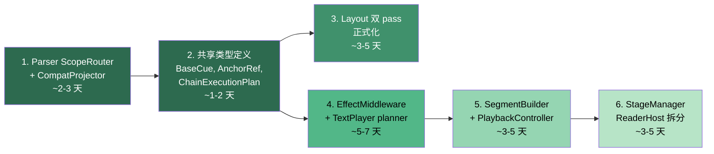

# docs/planning/roadmap/phase-a-refactor/ 第二轮审查报告

> 审查范围：四篇方案 + README.md（大改版后）
> 对照参考：第一轮审查意见 + 当前代码实态 + TODO Phase B/C

---

## 一、第一轮问题的修复追踪

| # | 第一轮指出的问题 | 修复状态 | 评价 |
|---|-----------------|---------|------|
| 1 | `DocumentSemanticIR` 缺具体定义 | ✅ 已补充 interface 骨架（ir L69-78） | 合格。字段合理，`sourceMap` 是好的加法 |
| 2 | Middleware 执行拓扑未讨论 | ✅ 新增 "Middleware 拓扑与依赖" 节（ir L112-137） | **优秀**。Effect→Layout→Stage 的依赖链和"样式信息先于测量"的核心矛盾现在有了正式表述 |
| 3 | `TextBuilder` 完全缺席 | ✅ execution 新增 §7（L133-152）+ layout §3 提及（L201-206）+ README 汇总 | 合格。没有单列文档但在三处覆盖了桥接性质、拆分方向 |
| 4 | `KineticChar` 瘦身路径空白 | ✅ ir 新增 "plan 与显示对象的投影边界"（L376-397）+ execution 新增 §9（L175-194） | **优秀**。`CharInstance` / `CueBinding` / `DisplayProjection` 的三层拆分方向清晰 |
| 5 | Legacy `play()` 无退役条件 | ✅ execution 新增 "Legacy play() 退役 gate"（L637-648） | 合格。4 条 gate 条件具体可检验 |
| 6 | Manager 单例可测试性 | ⚠️ parser 引入了 `CommandRegistryView` 注入接口（L100-108），但 Manager 本体的多实例化未讨论 | 部分修复。parser 侧解耦了，runtime 侧未动 |
| 7 | console.log 诊断治理 | ✅ ir 新增 "diagnostics/audit 跨层基础设施"（L423-448）+ execution §11 + README 术语 | 合格。`DiagnosticEvent` / `AuditEvent` 模型已定义 |
| 8 | 缺 README 总览索引 | ✅ 新增 `README.md`，含管线图、文档导航、术语约定、优先级 | **优秀** |
| 9 | 术语不统一（Middleware vs Planner） | ✅ README "术语约定" 节明确区分了 `*Middleware`（架构边界）与 `*Planner/*Runner/*Assembler`（内部实现） | **优秀** |
| 10 | "非目标" vs "延后目标" 不分 | ✅ 每篇都增加了独立的"延后目标"节 | 合格 |
| 11 | `ChainExecutionPlan` 缺接口骨架 | ✅ execution L328-338 给出了最小 interface | 合格 |
| 12 | `LayoutPreflightResult` 缺接口 | ✅ layout L153-159 给出了骨架 | 合格 |
| 13 | `AnchorRef` 缺具体类型 | ✅ parser L183-186 给出了 discriminated union | 合格 |
| 14 | `DocumentParser` 与 `Parser.ts` 关系未说明 | ✅ parser 延后目标明确了 "先 façade 并存，后收口"（L331-332） | 合格 |
| 15 | parser → Manager 依赖方向问题 | ✅ parser 新增 "parser 与 manager 的依赖方向" 节（L257-273），引入 `CommandRegistryView` | **优秀**。这直接解决了 LSP 提取的阻碍 |
| 16 | IR 层数过多（7+ 层）风险 | ⚠️ ir 延后目标提到"允许合并层级"（L502-503），但主方案仍保持 10 层 | 已表达灵活性，但主栈未精简 |

> [!TIP]
> **总修复率：14/16 完全修复，2/16 部分修复。** 第一轮审查的主要缺口已经系统性地补上。

---

## 二、新增内容评估

这次大改新增了约 **40% 的篇幅**（总字节从 ~28KB 增至 ~52KB）。新增内容可归为几个维度：

### 2.1 Cue / Policy / HostState / Audit 四象限（IR 文档核心新增）

ir-refactor L354-374 引入的分类框架：

```
Cue — 可规划、排序、绑定 anchor 的节点
Policy — mode / viewport / overwrite 等规则
HostState — animOffset、camera snapshot 等运行时状态
Audit — diagnostics / trace / report
```

**评价：这是本轮最有价值的新增。** 它回答了一个第一版完全没有触及的根本问题——"到底什么东西应该进入 Plan，什么不应该"。

当前代码中这四类概念确实是混淆的：
- `StageManager` 里 `camera` 是 HostState，但 `setMode()` 是 Policy，`camAuditLog` 是 Audit，`cam.move` 的注册函数返回值是 Cue — 全部揉在一个类里
- `KineticChar` 里 `animOffset` 是 HostState，`visualEffects` 是 Cue 绑定，`baseStyleSnapshot` 是 seek 基础设施 — 同样混合

这个分类框架如果在实施阶段能真正贯彻，会大幅降低"语义塞错层"的风险。

### 2.2 `ResolvedCue` + `BaseCue` 骨架（IR L282-352）

新增了 6 类 cue 的完整分类 + `BaseCue` 共享接口。

**评价：合格，但有一个设计张力需要决策。**

`BaseCue.id` 字段（L301）意味着每个 cue 是一个可追踪的实体。这对 Inspector 和 diagnostics 非常好，但它也意味着在 build 阶段需要生成 unique ID。当前 `buildTimeline()` 中的 cue 没有 ID 概念——它们是匿名的循环局部变量。引入 ID 后，每个 `tl.call()` 和 `tl.set()` 都需要对应一个 named cue origin。

> [!NOTE]
> 建议 `BaseCue.id` 在实施第一步设为 `optional`。先让分类框架落地，ID 追踪延后到 Inspector v2 需要时再强制。

### 2.3 StageManager 越界分析（Execution §10, L195-219）

新增了对 `StageManager` 承担的 4 个角色的拆分分析：`StageRuntime` / `ReaderHost` / `PresentationManager` / `RuntimeValueResolver`。

**评价：诊断精准，可对照代码验证。**

对照 [StageManager.ts](../../../../apps/editor/src/core/stage/StageManager.ts) 的 308 行代码：

| 提议角色 | 对应代码行 | 行数 | 可拆性 |
|----------|-----------|------|--------|
| StageRuntime（camera + registry + apply） | L34-48, L78-103, L140-189 | ~110 行 | ✅ 核心，保留 |
| ReaderHost（init + resize + pixi app） | L61-73, L239-268, L300-302 | ~50 行 | ✅ 清晰边界 |
| PresentationManager（setMode + viewport + letterbox） | L204-221, L270-297 | ~50 行 | ✅ 可提取 |
| RuntimeValueResolver（resolveValue + marker） | L121-138 | ~18 行 | ⚠️ 太薄 |
| AuditExport（dumpCamReport + camAuditLog） | L48, L176-184, L231-237 | ~15 行 | ⚠️ 太薄 |

`RuntimeValueResolver` 只有 18 行，`AuditExport` 只有 15 行。但从语义角度看，`resolveValue` 未来会扩展（`state.*` 变量求值），值得预留位置。`AuditExport` 则应合并到全局 `DiagnosticsCollector`。

### 2.4 "未命名 cue" 的收集（Execution §13, L257-279）

**评价：这是一项重要的"考古发现"。**

文档列出了 4 类当前在 runtime 中隐式生成但从未命名的 cue：lifecycle（token_end, line_break...）、playback（punctuation pause, breathing gap...）、stage（deferred apply, in-flight continuation...）、paragraph（auto placement, stacking...）。

这与代码完全吻合。例如 [TextPlayer.buildTimeline()](../../../../apps/editor/src/core/render/text/TextPlayer.ts) 中：
- L261 的标点符号暂停是匿名 playback cue
- L102 的换行呼吸间隔是匿名 lifecycle cue
- L235-251 的 token-end deferred stage 是匿名 stage cue

将这些命名化是让 `buildTimeline()` 从"过程式编译"走向"声明式 plan 消费"的前提。

### 2.5 `KineticText` 瘦身方向（Execution §8, L154-174）

**评价：方向正确，但需要与 `KineticText` 现有 API 消费者对齐。**

当前 [KineticText](../../../../apps/editor/src/core/KineticText.ts) 被 `ScriptPlayer` 在多处直接读写：
- L55: `kt.init()` — build 入口
- L72: `kt.rebuild()` — rebuild 入口
- L77: `kt.play()` — legacy playback facade
- L359: `kt._allCharsCached` — 直接访问内部 char 数组
- L354: `kt._pendingGlobalEffects` — 直接访问 pending effects

如果 `KineticText` 收缩为纯 display host，`ScriptPlayer` 就不应继续用 `kt._allCharsCached` 这样的私有属性。需要一个 `ParagraphInstance` 来持有 build 产物、exposed chars、pending effects。

### 2.6 四大 Manager 健康度评估（Execution §12, L237-256）

**评价：实用，可直接指导工作优先级。**

| Manager | 评估 | 改造优先级 |
|---------|------|-----------|
| EffectManager | Registry kernel 健康 | 低 — 保持 |
| StyleManager | Kernel 健康，少量硬编码 | 低 — 小修 |
| LayoutManager | 缺 metadata | 中 — 补 metadata |
| StageManager | 越界严重 | 高 — 拆分 |

这与代码实态完全匹配。`EffectManager`（82 行）和 `StyleManager` 确实只是 registry + apply，而 `StageManager`（308 行）确实承担了过多非 stage 职责。

---

## 三、可行性评估

### 3.1 Parser 拆分 — ✅ 可直接落地

`lowering.ts` → `ScopeRouter + SemanticLowerer + CompatProjector` 的拆分路径在第一轮就已确认可行。本轮新增的 `CommandRegistryView` 注入接口进一步降低了耦合风险。

**预计落地效果**：
- `lowering.ts` 从 461 行拆为 3 个 ~150 行模块
- `CompatProjector` 的隔离使 legacy 路径不再污染主 lowering
- 为 Phase B 的 `ControlFlowLowerer` 腾出干净的接入点

**风险**：低。纯函数提取，无 runtime 行为变化。

### 3.2 Layout 双 pass — ✅ 可落地

新增的 `LayoutPreflightResult` 骨架（含 `LinePlan`、`AnchorState`、`DiagnosticEvent`、`estimatedBounds`）给出了目标数据结构。

**预计落地效果**：
- phantom pass 和 calculate pass 的 ~200 行重复代码消除
- preflight 结果可被 IDE / Inspector 消费
- 为 `{var.xxx}` 插值的 reflow 提供基础

**风险**：中。`TextLayoutEngine` 的两个 pass 共享约 8 个状态变量（cursor、baseline、lineItems 等），正式化时需确保 preflight pass 不产生副作用（当前 phantom pass 会写入 `writtenKeys`）。

### 3.3 ChainExecutionPlan + TextPlayer 拆分 — ⚠️ 可落地但需小心

`ChainExecutionPlan` 的骨架已给出（execution L328-338），但实施时面临一个现实问题：

**当前 `buildTimeline()` 中的 chain mode 判断是运行时动态的**——它依赖 `allChars[i]` 的上下文（前一个 char 的 tokenIdx、当前 token 的最后一个 char 的 stage instructions 等）。将这些判断"前移到 plan"意味着 plan 阶段需要能访问 char 序列的结构信息。

这实际上要求 `ChainExecutionPlan` 的生成**发生在 `LayoutStreamBuilder.build()` 之后**（因为需要知道 char 的 tokenIdx 分组），但**发生在 `TextPlayer.buildTimeline()` 之前**。这是一个新的中间步骤，文档描述为 EffectMiddleware 的职责，但具体在管线中的调用点需要明确。

**预计落地效果**：
- `buildTimeline()` 从 ~225 行降至 ~120 行（消费 plan 而非现场编译）
- chain mode 判断从 TextPlayer 分散的 if/else 变为 middleware 中的集中 switch
- 为 `+` 并发链（Phase B B0.1）预留接入点

**风险**：中高。需要同时修改 `LayoutStreamBuilder`（产出 chain 元数据）和 `TextPlayer`（消费 plan），是跨模块改造。

### 3.4 ScriptPlayer 拆分 — ✅ 可落地

`SegmentBuilder` 和 `PlaybackController` 的边界在代码中已经清晰。`StageTimelineCoordinator` 保留为函数而非类（第一轮建议被接受）。

**预计落地效果**：
- `ScriptPlayer.ts` 从 770 行降至 ~200 行（orchestrator shell）
- `buildSegment()` 的 330 行提取为独立 `SegmentBuilder`
- seek/replay 逻辑提取为 `PlaybackController`

**风险**：低。自然边界清晰，`buildSegment()` 已经是一个独立方法。

### 3.5 StageManager 拆分 — ⚠️ 有难度但必要

本轮新增的 `ReaderHost` / `PresentationManager` 拆分是正确方向，但 `StageManager` 的 `init()` 方法直接访问 `readerApp.pixiApp.stage`（L64），resize 监听绑定在 `readerApp.pixiApp.renderer`（L69），这意味着拆分需要同时调整 `App.ts` 的初始化顺序。

**预计落地效果**：
- `StageManager` 收缩为纯 stage runtime（~120 行）
- Reader/presentation 逻辑移入独立模块
- 为 LSP / headless 运行时扫清障碍

**风险**：中。涉及应用初始化生命周期。

---

## 四、完成度评估

### 4.1 作为"方案文档"的完成度

| 维度 | R1 评分 | R2 评分 | 说明 |
|------|---------|---------|------|
| 问题诊断 | 8/10 | 9/10 | 补上了 TextBuilder、KineticChar、StageManager、未命名 cue |
| 目标结构 | 6/10 | 8/10 | 核心接口骨架已就位（BaseCue, ChainExecutionPlan, LayoutPreflightResult, AnchorRef, DocumentSemanticIR） |
| 术语一致性 | 4/10 | 9/10 | README 术语约定 + Cue/Policy/HostState/Audit 四象限 |
| 迁移路径 | 7/10 | 8/10 | 每篇的迁移顺序 + 延后目标 + 退役 gate |
| 代码对齐度 | 5/10 | 8/10 | 对 Manager 健康度、KineticChar 字段、TextBuilder 胶水性质的分析都与代码高度吻合 |
| 可执行性 | 5/10 | 7/10 | 有接口骨架但仍缺具体的"第一刀在哪里切"的 diff 级指引 |

### 4.2 仍存在的缺口

#### 缺口 A：`LayoutStreamBuilder` 三角拆分的具体方案仍模糊

Layout 文档说拆成 `LayoutPlanner` / `DisplayAssembler` / `CompatBinder`（L184-191），但没有说明：
- `LayoutStreamBuilder.build()` 的 236 行代码中哪些行归哪个角色
- `EffectProcessor.partition()` 调用（L41）属于哪个角色
- `KineticChar` 创建（L183）属于 `DisplayAssembler` 还是 `CompatBinder`

这是唯一一个仍停留在"方向正确但缺行动指引"的模块。

#### 缺口 B：`ParagraphPlacementCoordinator` 的定位未跟进第一轮建议

第一轮建议合并到 `SegmentBuilder`（因为只有 ~35 行）。本轮 execution 文档仍将其列为独立角色（L581-586）。从代码看：

```typescript
// ScriptPlayer.buildSegment() L253-270 — placement 逻辑
if (this.currentMode === "stage" || this.currentMode === "scroll") {
  kt.isAutoLayout = true;
  posX = align === "center" ? (dWidth - maxWidth) / 2 : dWidth * 0.1;
  posY = layout.currentY;
} else { /* page mode */ }
```

这 ~18 行的分支逻辑确实太薄，不值得独立模块。但如果未来 scroll/page/interactive 三模式各自扩展到 50+ 行，独立可能有意义。

**建议**：第一刀保留在 `SegmentBuilder` 内部作为 `private placeParagraph()`，预留独立化的空间但不过早拆分。

#### 缺口 C：IR 层数的实际落地策略

主栈仍列出 10 层（README L9-19）。虽然延后目标提到"允许合并层级"，但没有给出具体的**简化启动路径**——即第一刀落地时实际使用几层。

**建议**：第一刀应只引入 **4 层**：

```
ParagraphAst（已有）
  → SemanticParagraphIR（= 当前 ParagraphIR 升级）
  → EffectMiddleware preview + LayoutMiddleware plan
  → ParagraphExecutionPlan（新增，取代 charData 直接消费）
```

`DocumentAST`、`DocumentSemanticIR`、`ResolvedParagraphIR`、`SegmentGraphPlan` 延后到 Phase B control flow 需要时再引入。

---

## 五、结论与建议

### 整体判断

> [!IMPORTANT]
> **方案已就绪，可以进入实施阶段。** 不需要第三次大改动。

第二版在第一版的基础上完成了三项关键升级：
1. **概念骨架**：从纯文字描述升级到有 TypeScript 接口签名
2. **覆盖面**：从 "parser + layout + execution" 三模块扩展到包含 TextBuilder、KineticChar/KineticText、StageManager、Manager 健康度、diagnostics 的全局视图
3. **分类框架**：Cue/Policy/HostState/Audit 四象限为"什么该进 Plan，什么不该"提供了判断标准

### 落地前的最后几个微调

这些不需要再写一轮完整文档修订，在实施过程中顺手处理即可：

1. **`BaseCue.id` 设为 optional**（避免第一步就引入 ID 生成负担）
2. **`ParagraphPlacementCoordinator` 合并到 `SegmentBuilder` 内部**
3. **第一刀实际 IR 层数限制为 4 层**（`ParagraphAst → SemanticParagraphIR → Middleware Plans → ParagraphExecutionPlan`）
4. **`LayoutStreamBuilder` 三角拆分在实施时再细化**（先做 Parser 和 Execution 两端，Layout 中间层最后动）

### 推荐的实施顺序（更新版）



> 步骤 2（共享类型定义）是新增的——在开始任何模块拆分之前，先在 `src/core/types/` 下定义 `BaseCue`、`AnchorRef`、`ChainExecutionPlan`、`LayoutPreflightResult`、`DiagnosticEvent` 等共享类型。这使后续各步骤有统一的契约面。
