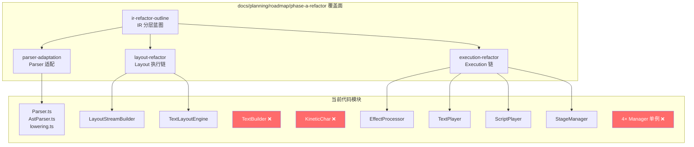

# docs/planning/roadmap/phase-a-refactor/ 重构方案审查报告

> 审查范围：`ir-refactor-outline.md`、`layout-refactor-outline.md`、`parser-adaptation-outline.md`、`execution-refactor-outline.md`
> 对照参考：当前代码实态（Phase A 完成后）+ `docs/planning/TODO.md` Phase B/C/P 路线图

---

## 一、总体评价

### 优点

1. **问题诊断精准**。四篇文档对当前架构的痛点识别非常到位——lowering 职责过厚、TextPlayer 沦为"现场编译器"、ScriptPlayer 五职合体、双 pass 未正式化、marker 字符串协议脆弱——都与代码实态完全吻合。
2. **层级思维一致**。IR 文档提出的分层栈（`DocumentAST → SemanticIR → Middleware → ExecutionPlan → Runtime`）贯穿其他三篇，每篇都明确"自己负责哪一层、上下游是谁"，避免了各自为政。
3. **审慎的迁移策略**。所有文档都提出"并行输出 + compat projector"渐进路线，而非推倒重来。这对一个已经能工作的引擎非常合理。
4. **面向未来的预留**。每篇都显式提到 Phase B（SegmentGraph/State/ControlFlow）和 v1.7（Plugin/Hook），预留了类型和入口。

### 问题

这四篇更像是**同一次对话的产物**——它们共享统一视角、语气一致、抽象层级对齐。这是优点也是缺点：它们缺少来自独立审视的**对抗性张力**。下面逐篇展开。

---

## 二、逐篇审查

### 1. [ir-refactor-outline.md](./ir-refactor-outline.md) — IR 分层设计

#### 组织 ✅

文档结构清晰：背景 → 分层 → 各层职责 → 中间件 → 共享类型 → 迁移顺序。作为顶层蓝图文档，它的定位正确。

#### 覆盖面 ⚠️

| 已覆盖 | 缺口 |
|--------|------|
| 三大 Middleware 的输入/输出类型草案 | 没有给出任何一个 Middleware 的伪代码或接口签名 |
| `DocumentAST` → `SemanticParagraphIR` → `ResolvedParagraphIR` 三级 IR | `DocumentSemanticIR` 的具体结构空白——它应该包含什么？Paragraph 序列 + ControlFlow 节点 + FrontMatter？ |
| `ControlFlowMiddleware` / `StateMiddleware` 预留 | 没有讨论 Middleware 之间的执行顺序与数据依赖 |
| 插件化 Hook 预留 | Hook 的粒度与 Middleware 的关系未明确（Hook 是 Middleware 的子集还是平行层？） |

#### 解决方案评估

> **核心风险：IR 层数过多**

文档列出了约 10 层变换：

```
Source → DocumentAST → DocumentSemanticIR → SemanticParagraphIR
→ ResolvedParagraphIR → Layout/Effect/StageMiddleware
→ ParagraphExecutionPlan → SegmentExecutionPlan → SegmentGraphPlan → Runtime
```

对于当前代码体量（parser ~42KB, layout ~48KB, player ~64KB），这个层数偏多。实际上当前代码中：

- `ParagraphAst` → `ParagraphIR` → `KMDParagraphData` 是**3 层**
- 而提案要变成**7+ 层**（DocumentAST、DocumentSemanticIR、SemanticParagraphIR、ResolvedParagraphIR、3× Middleware Plan、ParagraphExecutionPlan）

> [!WARNING]
> 建议合并 `SemanticParagraphIR` 和 `ResolvedParagraphIR` 为一层。当前 `lowering.ts` 的 scope routing 逻辑大约 300 行，不足以拆出一个独立的 "resolved" 中间态。等到 Plugin/Hook 真正需要稳定输入面时再拆不迟。

#### 具体建议

1. **给 `DocumentSemanticIR` 一个具体定义**。它至少应包含：`frontMatter: KMDMetadata`、`paragraphs: SemanticParagraph[]`、`controlFlow: ControlFlowNode[]`、`documentTags: string[]`。
2. **明确 Middleware 执行拓扑**。Layout → Effect → Stage 是否有严格顺序？当前代码中 `LayoutStreamBuilder` 确实需要先知道 visual effect 以预测测量样式（`applyInitialStylesToStyle`），这是一个反向依赖——Layout 依赖 Effect 的初始样式信息。这个依赖在 IR 文档中完全没有讨论。
3. **减少"建议"增加"决议"**。文档大量使用"建议"/"推荐"措辞。作为方案文档，核心决策应明确拍板。

---

### 2. [layout-refactor-outline.md](./layout-refactor-outline.md) — 布局执行链

#### 组织 ✅

问题分析扎实（5 个已确认问题），重构目标清晰（5 点），非目标合理。

#### 覆盖面 ⚠️

| 已覆盖 | 缺口 |
|--------|------|
| 双 pass 正式化 (`preflight + final placement`) | **缺少对 `LayoutStreamBuilder` 真正痛点的定量分析** |
| 拆分 `TextLayoutEngine` 为 4 角色 | **没有处理 `LayoutStreamBuilder.build()` 中的样式测量反向依赖** |
| 收缩 `LayoutStreamBuilder` | **`TextBuilder`（不在提案中！）的角色完全未提及** |
| 结构化 Anchor 系统 | 现有 `phantom_*` 临时标记的迁移路径空白 |

#### 解决方案评估

> **核心问题：未触及真正的耦合热点**

我审查了 [LayoutStreamBuilder.ts](../../../../apps/editor/src/core/layout/LayoutStreamBuilder.ts) 的实际代码。文档说"timing / stage / playback 相关信息不应长期继续寄宿在 layout-only builder 中"，但代码告诉我实际情况比这更复杂：

```typescript
// LayoutStreamBuilder.build() L41-42 — 每个 token 的 partition
const { layoutCmds, visualConfigs, stageConfigs } = EffectProcessor.partition(token.effects);
```

`LayoutStreamBuilder` 不只是"寄宿"了 playback 信息——它**主动调用 `EffectProcessor.partition()`** 来分流指令，并且**创建 `KineticChar` 实例**（L183）、**应用初始样式**（L54）、**解析变量引用**（L48-50）。这意味着它既是 Layout 的输入构造器，又是 Execution 的数据装配器，同时还是显示对象工厂。

文档建议拆成 `LayoutPlanner` + `CharAssembler`，但实际上需要拆成 **三**个角色：

1. **`LayoutPlanner`** — 纯布局 stream 构建（只需字符宽高和指令）
2. **`CharFactory`** — KineticChar 创建 + 样式应用 + 基准快照
3. **`DataAssembler`** — 将 layout 结果、visual effects、stage instructions、timing sugars 组装到 charData

> [!IMPORTANT]
> 文档遗漏了 `TextBuilder`（`src/core/render/text/` 下，KineticText.init() 调用的构建器）。它是 `LayoutStreamBuilder` 的直接消费者，在讨论 layout 拆分时不能缺席。

#### 具体建议

1. **补充 `TextBuilder` 在管线中的位置和改造方向**。
2. **处理样式-测量循环依赖**：Layout 需要知道字号来测量宽度，但字号可能被 visual effect 修改。当前通过 `applyInitialStylesToStyle` 提前打快照解决，但这个 workaround 本身就是 Layout/Effect 未解耦的证据。重构方案应对此给出正式解法。
3. **双 pass 正式化的优先级应该最高**。当前 `TextLayoutEngine` 中 phantom pass 和 calculate pass 的重复逻辑（约 400 行中的 ~200 行重复）是真正的维护噩梦——每次改一个换行规则都要改两处。

---

### 3. [parser-adaptation-outline.md](./parser-adaptation-outline.md) — Parser 适配

#### 组织 ✅

结构完整：做对的事 → 局限 → 适配目标 → 模块拆分 → 新增输出能力 → 兼容策略 → 迁移顺序。

#### 覆盖面 ✅（四篇中覆盖面最好的一篇）

| 已覆盖 | 缺口 |
|--------|------|
| `DocumentParser` 新增 | 缺 `DocumentParser` 与现有 `Parser.ts` 的关系（替代？包装？） |
| `lowering.ts` 拆分为 3 角色 | 合理且可行 |
| `AnchorRef`/`ChainNode`/`ControlNode` 结构化 | 完整 |
| `InterpolationNode` (`{var.xxx}`) | 与 `LayoutStreamBuilder` L48 现有 `var.` 处理的衔接未提 |
| 插件化预留 (SugarRegistry, afterParse) | 方向正确 |

#### 解决方案评估

> **最可行的一篇**

文档提出的拆分（`ScopeRouter + SemanticLowerer + CompatProjector`）与当前 `lowering.ts` 的代码结构高度吻合：

- `applyBlockOptionCommands()` → `ScopeRouter` 的段落级路由
- `applyLineCommands()` → `ScopeRouter` 的行级路由  
- `buildInlineFromAst()` → `SemanticLowerer`
- `inlineToLegacyToken()` + `buildParagraphData()` → `CompatProjector`

这三块在现有代码中已经是相对独立的函数，拆成模块的风险最低。

> **但有一个隐患：`ChainNode` 的结构化深度**

文档建议 ChainNode 区分 `visual`/`style`/`stage`/`layout`/`delay`/`advance`/`ease`/`parallel_group` 8 种类型。但当前 `CommandChainAst` 中 commands 只是 `ParsedCommand[]`，区分类型依赖 runtime 的 `commandCatalog.ts`（查 Manager 注册表）。

如果要在 parser 阶段就区分 ChainNode 类型，parser 就必须依赖 Manager 注册表——**这正是当前 `commandCatalog.ts` 已经做的事**。问题是：这个依赖方向是否合理？Parser 应该依赖 Effect/Style/Stage/Layout Manager 吗？

> [!NOTE]
> 当前实际上已经有这个依赖（[commandCatalog.ts](../../../../apps/editor/src/core/parser/commandCatalog.ts) L1-4 直接 import 四大 Manager）。但如果走 LSP 方向（TODO V1），parser 需要独立于浏览器运行时。这个依赖方向会成为 LSP 提取的阻碍。

#### 具体建议

1. **`ChainNode` 类型区分应推迟到 `ScopeRouter` 而非 `AstParser`**。让 AST 层保持命令名为字符串，类型标注在 lowering/routing 阶段完成。这样 parser 核心不依赖 Manager。
2. **补充 `DocumentParser` 与 `Parser.ts` 的关系**。当前 `Parser.ts` 做 frontmatter 解析 + paragraph 分割 + 调用 `AstParser` + `lowering`。`DocumentParser` 是否替代 `Parser.ts`？如果是，应明确说明。
3. **为 LSP 提取预留无副作用的 parser 边界**。`commandCatalog.ts` 对 Manager 的依赖可以通过注入（构造时传入 name registry）解耦。

---

### 4. [execution-refactor-outline.md](./execution-refactor-outline.md) — Execution 链

#### 组织 ✅

最详尽的一篇（336 行），问题分析、目标结构、模块拆分、迁移顺序一应俱全。

#### 覆盖面 ⚠️

| 已覆盖 | 缺口 |
|--------|------|
| `TextPlayer` → planner 前移 | **缺少对 `buildTimeline()` 900 行代码的具体分解方案** |
| `ScriptPlayer` 拆 5 角色 | `SegmentBuilder` 与 `StageTimelineCoordinator` 的边界模糊 |
| Stage 冲突 diagnostics-first | 方向正确 |
| `DeterministicTimelinePlan` vs `InteractiveRuntimePlan` 双 backend | 完整 |
| 四类 execution cue | `StateCue` 的 snapshot/restore 与 Checkpoint 的关系未明确 |
| Source Map / IDE 需求 | 需求正确但无具体方案 |

#### 解决方案评估

> **核心问题：TextPlayer 的拆分方案不够具体**

[TextPlayer.buildTimeline()](../../../../apps/editor/src/core/render/text/TextPlayer.ts#L61-L285) 是 Phase A 最复杂的单个方法（~225 行），内部混合了：

- **时序状态机**（L76-88：cursor、persistentSpeedMult、groupSpeedMult、groupForkCursor、pauseCharOverride、deferredCursorAdvance 等 8 个状态变量）
- **链模式判断**（L219-231：hold:char 检测 → `unrollCharChain` vs `unrollGroupChain`）
- **stage 指令分时触发**（L163-184、L235-251：空字符立即触发 vs 非空字符延迟到 token 末）
- **advance 信号分流**（L148-159：`>>>` block advance 和 `>>` group fork）

文档说"chain mode 决策、hold/ease/stagger 语义判定"应前移，但没有说明 **前移到哪里、以什么数据结构承载**。`ChainExecutionPlan` 应该长什么样？

```typescript
// 提议的 ChainExecutionPlan 骨架（文档中完全缺失）
interface ChainExecutionPlan {
  mode: 'group_sync' | 'char_stagger' | 'char_tween' | 'container_only';
  effects: ResolvedCue[];
  holdDuration?: number;
  stageInstrs: StageCue[];
  pauseDuration: number;
}
```

> **ScriptPlayer 拆分的可行性**

文档提议拆为 5 个角色。对照当前 [ScriptPlayer.ts](../../../../apps/editor/src/core/player/ScriptPlayer.ts) 的 770 行代码：

| 提议角色 | 对应代码 | 行数 | 拆分可行性 |
|----------|----------|------|-----------|
| `SegmentBuilder` | `buildSegment()` L178-507 | ~330 行 | ✅ 自然边界清晰 |
| `StageTimelineCoordinator` | `trimActiveStageTween()` + `activeStageTweens` Map | ~100 行 | ✅ 已经是独立函数 |
| `PlaybackController` | `playSegment/pauseSegment/seekToTime/registerBehaviors/replayStyles` | ~120 行 | ✅ 可提取 |
| `ParagraphPlacementCoordinator` | `buildSegment()` 内 L237-270 的定位逻辑 | ~35 行 | ⚠️ 太薄，不值得独立模块 |
| `GraphRuntimeCoordinator` | 不存在 | 0 行 | 🔮 Phase B 再添加 |

`ParagraphPlacementCoordinator` 当前只有 ~35 行定位逻辑，独立成模块过早。建议保留在 `SegmentBuilder` 内部作为私有方法。

#### 具体建议

1. **给 `ChainExecutionPlan` 一个具体接口定义**。这是 TextPlayer 重构的支点。
2. **合并 `ParagraphPlacementCoordinator` 到 `SegmentBuilder`**。
3. **保留 `trimActiveStageTween` 为独立函数而非类**——它目前就是一个纯函数，没有状态，不需要成为 `StageTimelineCoordinator` 类。等 Phase B 引入跨 Segment 的 camera continuity 时再升级为有状态协调器。

---

## 三、交叉分析：覆盖面盲区

### 盲区 1：`TextBuilder` 完全缺席

`TextBuilder`（由 `KineticText.init()` 调用）是 `LayoutStreamBuilder` 的直接消费者，负责将 layout stream 注入到 `TextLayoutEngine` 并生成最终 `KineticChar[]`。四篇文档都没有提到它，但它实际上是 Layout → Execution 的桥梁。

### 盲区 2：`KineticChar` 数据承载过载

[KineticChar](../../../../apps/editor/src/core/KineticChar.ts) 当前同时承载：

- 显示对象（Pixi Container）
- 视觉特效列表 (`visualEffects`)
- 时序糖衣 (`timingSugars`)
- 舞台指令 (`stageInstructions`)
- 基准样式快照 (`baseStyleSnapshot`)
- 动画偏移层 (`animOffset`)

如果引入 Execution Plan，这些数据应该**从 KineticChar 移到 Plan 中**，KineticChar 回归纯显示对象。但四篇文档都没有讨论 KineticChar 的瘦身路径。

### 盲区 3：Legacy play() 路径的退役时间表

[TextPlayer](../../../../apps/editor/src/core/render/text/TextPlayer.ts) 仍保留了 L641-778 的 legacy `play()` 方法（~140 行，setTimeout 驱动）。四篇文档都说"不急于删除 legacy"，但没有给出**何时可以安全删除的条件**。建议定义明确的退役 gate：

> Legacy `play()` 可在以下条件全部满足后删除：
> 1. `buildTimeline()` 路径覆盖所有 presentation mode
> 2. seek/replay 功能通过 Segment Timeline 100% 验证
> 3. 无外部调用方依赖 `play()` 的 Promise 返回值

### 盲区 4：Manager 单例的可测试性

当前四大 Manager（Effect/Style/Layout/Stage）都是模块级单例 export。这对 LSP 提取（需要多实例）和单元测试（需要隔离）都是障碍。Parser 适配文档提到了 LSP 需求，但没有讨论 Manager 依赖注入化。

### 盲区 5：当前 console.log 诊断的治理

`LayoutStreamBuilder.build()` 中有 ~5 处 `console.log` 诊断输出（L55、L82-83、L224-226），`ScriptPlayer.buildSegment()` 中有 ~4 处。Execution 文档提出 "diagnostics-first" 策略，但没有规划如何将这些散落的 console.log 收束到正式的 diagnostic 系统中。

---

## 四、组织与覆盖面评估矩阵



> 红色 ❌ = 四篇文档完全未覆盖的关键模块

---

## 五、优先级建议

基于代码实态和 TODO Phase B 的需求，建议以下执行顺序：

### 🥇 第一优先：Parser ScopeRouter 提取 + CompatProjector 隔离

**理由**：`lowering.ts` 的拆分风险最低、价值最高。它直接为 Phase B 的 `ControlFlowLowerer` 腾出空间，同时隔离 legacy 兼容层。

**工作量预估**：~2-3 天（461 行 → 3 个模块，纯函数提取）

### 🥈 第二优先：TextLayoutEngine 双 pass 正式化

**理由**：phantom pass / calculate pass 的代码重复是当前最大的维护风险。正式化后，Phase B 的 `{var.xxx}` 插值引起的 reflow 才有可靠基础。

**工作量预估**：~3-5 天

### 🥉 第三优先：ChainExecutionPlan 类型定义 + TextPlayer planner 提取

**理由**：这是 Execution 重构的支点。一旦 `ChainExecutionPlan` 定义清楚，TextPlayer 的 `buildTimeline()` 就能从"现场编译"转为"消费 plan"。

**工作量预估**：~5-7 天

### 🏅 第四优先：ScriptPlayer 拆分（SegmentBuilder + PlaybackController）

**理由**：依赖第三优先完成。`buildSegment()` 提取为独立 `SegmentBuilder` 后，Phase B 的 `GraphRuntimeCoordinator` 才有接入点。

**工作量预估**：~3-5 天

### 延后项

- IR 分层的 `DocumentSemanticIR` / `ResolvedParagraphIR` — **等 Phase B control flow 语法落地后再定义**
- `StageTimelineCoordinator` 升级为类 — **等 Phase B/C 跨 Segment camera continuity 需求出现后再升级**
- 插件化 Hook 注入点 — **v1.7 范畴，当前只需预留类型**

---

## 六、对文档本身的改进建议

1. **每篇增加一个"接口签名草案"节**。目前四篇都在概念层讨论，缺乏 TypeScript 接口定义。至少核心类型（`ChainExecutionPlan`、`LayoutPreflightResult`、`AnchorRef`、`DocumentSemanticIR`）应给出 interface 骨架。

2. **增加一篇 `textbuilder-kineticchar-outline.md`**。`TextBuilder` 和 `KineticChar` 的改造是连接 Layout 和 Execution 重构的桥梁，当前完全空白。

3. **增加一个总览索引文件**。建议在 `docs/planning/roadmap/phase-a-refactor/README.md` 中放一张管线图 + 各篇文档的导航。当前四篇的相互引用在末尾三行带过，不够醒目。

4. **明确"非目标"之外的"延后目标"**。当前每篇的"非目标"列表隐含了一些实际上是**延后到下一阶段**的内容，但读者分不清"永远不做"和"现在不做"。

5. **统一 Middleware 术语**。IR 文档用 `LayoutMiddleware`，Layout 文档用 `LayoutPlanner` / `LayoutPassRunner`，Execution 文档用 `EffectMiddleware` — 这三个是同一个东西的不同名字吗？需要统一。
