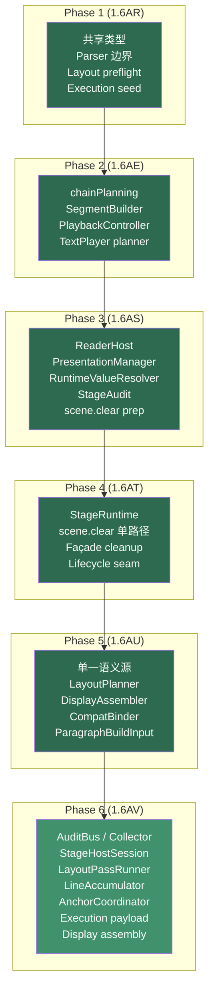

# Phase 6 (1.6AV) 代码审查报告

> 审查范围：Phase 6 全量增量（WP1–WP8），覆盖 diagnostics/audit 总线、`StageManager` 第二轮瘦身、layout middleware seed、execution payload decoupling、display host split prep
> 对照参考：`docs/refactor/phase-6-implementation-plan.md`
> 审查时间：2026-05-07
> 验证状态：`vue-tsc -b` 通过，`pnpm build` 通过，`pnpm test:parser` 通过，关键样例回归已补齐

---

## 一、结论摘要

Phase 6 是 Phase A 最后一个阶段，完成了 8 个工作包（WP1–WP8）。方向正确且落地扎实——diagnostics/audit 有了统一总线，`StageManager` 完成第二轮瘦身，layout 引擎拆出 3 个中间件辅助模块，execution 主路径切到 assembly payload 驱动，`KineticChar` 上的语义字段已正式降级为 compat surface。

**核心成果**：Phase B 启动前的 4 大结构债（diagnostics 散落、StageManager 过厚、layout 双 pass 复制、execution 反读 KineticChar）已全部收口到可控状态。

**收尾更新（2026-05-07）**：审查中指出的 debug `console.log` 噪音已清理；Phase 6 文档状态、验证记录与下一阶段导航已统一到“Phase A 完成 / Phase B 启动准备完成”。

---

## 二、变更总览

### 新增文件（13 个）

| 文件 | 行数 | 所属 WP | 职责 |
|------|------|---------|------|
| `src/core/diagnostics/AuditBus.ts` | 49 | WP1 | runtime-scope 审计事件总线，bounded buffer |
| `src/core/diagnostics/DiagnosticsCollector.ts` | 70 | WP1 | build-scope 诊断收集器，自动订阅 AuditBus |
| `src/core/diagnostics/ConsoleDiagnosticsSink.ts` | 41 | WP1 | 格式化 console 输出适配器 |
| `src/core/stage/StageHostSession.ts` | 171 | WP2 | host mount/resize/ticker/letterbox/world transform |
| `src/core/layout/LayoutPassRunner.ts` | 127 | WP3 | preflight/calculate 共享遍历骨架 |
| `src/core/layout/LineAccumulator.ts` | 162 | WP7 | 行状态推进、对齐、bounds 计算 |
| `src/core/layout/AnchorCoordinator.ts` | 116 | WP7 | reserved marker 更新、phantom marker 同步 |
| `src/core/layout/LayoutAuditEmitter.ts` | 86 | WP7 | layout audit 事件发射到统一 bus |
| `src/core/render/text/TextPlanDiagnosticsSink.ts` | 31 | WP4 | execution plan 诊断输出 |
| `src/core/render/text/TextStageCueScheduler.ts` | 61 | WP4 | stage 指令调度与 pause 计算 |
| `src/core/render/text/TextTimelineCursor.ts` | 121 | WP4 | timeline cursor 状态机 |
| `src/core/player/ScriptSourceLoader.ts` | 26 | WP4 | 脚本源文件加载 |
| `src/core/player/ScriptBuildReporter.ts` | 74 | WP4 | build session 审计与 diagnostics 汇报 |

### 主要修改文件

| 文件 | 变化要点 | 所属 WP |
|------|----------|---------|
| `StageManager.ts` | 245 行，host session 委托，compat getter 降级 | WP2 |
| `StageAudit.ts` | 新增 `UnifiedStageAuditPort`，双写 bus + collector | WP1/WP2 |
| `TextLayoutEngine.ts` | 214 行，重写为 `LayoutPassRunner` + hooks 驱动 | WP3/WP7 |
| `TextPlayer.ts` | ~880 行，cursor/scheduler/diagnostics 三拆 | WP4/WP6 |
| `ScriptPlayer.ts` | 274 行，source loader/build reporter 收口 | WP4 |
| `KineticText.ts` | 176 行，持有 `_displayAssembly`，legacy mirror 降级 | WP8 |
| `KineticChar.ts` | 201 行，语义字段标 `@deprecated` | WP6 |
| `DisplayAssembler.ts` | 146 行，输出 execution payload + display object | WP6 |
| `paragraphExecutionPlan.ts` | 81 行，消费 assembly payload 而非 KineticChar | WP6 |
| `SegmentBuilder.ts` | 482 行，切到 assembly 驱动 | WP6/WP8 |
| `LayoutEngine.ts` | `dumpReport()` 降级为 compat wrapper | WP3 |

---

## 三、逐 WP 评审

### WP1. Unified DiagnosticsCollector / AuditBus ✅

**设计评价：简洁有效。**

两个核心抽象恰到好处：

- `AuditBus`（49 行）：runtime-scope 事件广播，bounded buffer（500 条），支持 `subscribe()` 返回 unsubscribe
- `DiagnosticsCollector`（70 行）：build-scope 汇聚，自动订阅 AuditBus，提供 `snapshot()` 快照

```
AuditBus.emit()
  → listeners (fan-out)
  → DiagnosticsCollector.recordAudit() (自动订阅)

DiagnosticsCollector.reportDiagnostic()
  → 独立的 diagnostics 缓冲区
```

`ConsoleDiagnosticsSink` 是无状态的静态工具类，按 severity 分流到 `console.error/warn/info`，附带 subsystem 和 origin 上下文。

**已接入的入口**：

| 子系统 | 接入方式 |
|--------|----------|
| Parser | `ScriptBuildReporter.reportParseResult()` → collector + bus |
| Layout | `LayoutAuditEmitter.emitPreflight/emitCalculation()` → bus |
| Stage | `UnifiedStageAuditPort.record/reportConflict()` → bus + collector |
| Execution | `TextPlanDiagnosticsSink.reportPlan()` → collector + console |
| Script | `ScriptBuildReporter.reportSegmentBuilt()` → bus |

**bounded retention 已落地**：`AuditBus` 500 条，`DiagnosticsCollector` 各 500 条，`StageAudit` 300/150 条。`ScriptBuildReporter.beginBuildSession()` 在每次 load 时 clear 两者。

> [!NOTE]
> **观察：模块级单例 `auditBus` / `diagnosticsCollector` 的生命周期由 `ScriptBuildReporter.beginBuildSession()` 管理。** 当前只有 `ScriptPlayer.load()` 调用它，路径唯一。如果未来有多处 build 入口，需要确保 reset 不会误清另一个 build session 的数据。当前不构成问题。

### WP2. StageManager Round 2 Slimming ✅

**`StageHostSession`（171 行）成功承接了 host 绑定全套职责：**

| 职责 | 方法 |
|------|------|
| Host 挂载 | `attachHost()`, `init()` |
| Resize | `refresh()` → `resize()` |
| Letterbox | `resize()` 内 letterbox 绘制 |
| World transform | `updateWorldTransform()` + ticker 绑定 |
| Background | `syncBackgroundColor()` |
| Lifecycle | `clearHostBindings()` + disposer 数组 |

**`StageManager` 现在的职责分布：**

```
StageManager 245 行：
├── 构造 + session/presentation 初始化    ~55 行
├── Runtime 委托 (register/apply/modifier)  ~10 行（全部一行转发）
├── Presentation 委托 (design/viewport)     ~20 行
├── State dump/load                        ~25 行
├── Mode/resolution/bg                     ~30 行
├── Audit snapshot + compat getters        ~35 行
├── Compat deprecated (dumpCamReport)      ~15 行
└── Module-level singleton + re-exports    ~10 行
```

相比 Phase 4 的 282 行，虽然行数类似（245 行），但关键变化是 **host listener / resize / ticker / world transform 逻辑全部移出**。`StageManager` 不再直接操作 Pixi `Container` 的 `scale/rotation/position/pivot`——这些现在是 `StageHostSession.updateWorldTransform()` 的职责。

**compat 出口收紧确认**：

```typescript
/** @deprecated 兼容期 getter。未来请改用 `getAuditSnapshot().entries`。 */
public get camAuditLog(): StageAuditEntry[] { ... }

/** @deprecated 兼容期导出入口。未来应改走统一 AuditBus / DiagnosticsCollector。 */
public dumpCamReport() { ... }
```

> [!NOTE]
> **观察：`StageHostSession` 通过构造参数注入 `resolveComposedCameraState` 和 `getBackgroundColor` 回调。** 这避免了对 `stageRuntime` 的直接 import，保持了 session 的可测试性。设计合理。

### WP3. Layout Diagnostics and Pass Tightening ✅

**`LayoutPassRunner`（127 行）成功抽象了双 pass 共享骨架：**

```typescript
LayoutPassRunner.run<TState>(stream, state, {
  beforeNode?,
  onCommand?,
  onNewline?,
  onWrap?,
  onItem?,
  afterItem?,
});
```

`preflight()` 和 `calculate()` 现在共享：

- `findFirstLineMaxAscent()` — 首行 ascent 计算
- `createContext()` — context 初始化
- `shouldWrap()` — overflow 判定
- `measureItem()` — stepDistance 计算（tracking + letterSpacing）
- stream 遍历 + command dispatch 骨架

**`TextLayoutEngine` 从原来的 ~350+ 行收缩到 214 行**，主体变为 `LayoutPassRunner.run()` 的 hooks 配置。

**`LayoutEngine.dumpReport()` 已降级：**

```typescript
public dumpReport(): LayoutAuditRecord[] {
  console.warn("[LayoutEngine] dumpReport() is deprecated; prefer unified audit snapshot.");
  auditBus.emit({ ... });
  return logs;
}
```

> [!WARNING]
> **Finding #1 [Low]：`TextLayoutEngine.calculate()` 中仍有 3 处 `console.log` 硬编码。**
>
> - L78-81: `[Phantom-Trace] Line ${idx} baseline: ...`
> - L176-178: `[Layout-Math] Char: "${charText}", height: ...`
> - L186-188: `[Layout-Spacing] Char: "${charText}", width: ...`
>
> 这些是调试期遗留，在生产构建中会产生大量输出。建议移除或改走 `AuditBus`。

### WP4. Execution Monolith Split and Legacy Tightening ✅

**从 `TextPlayer` 中成功拆出三个独立模块：**

**1. `TextPlanDiagnosticsSink`（31 行）**
- `reportPlan()`: 归一化 plan diagnostics → collector + console
- `warnMissingChainPlan()`: char_stagger fallback 警告
- 所有输出统一走 `diagnosticsCollector` + `ConsoleDiagnosticsSink`

**2. `TextStageCueScheduler`（61 行）**
- `collectPauseAdvance()`: 计算 pause 指令的累计时长
- `schedule()`: 将 stage 指令挂到 timeline，区分 modifier-based（`tl.call()`）和 tween-based（`captureTween()`）

**3. `TextTimelineCursor`（121 行）**
- 完整的 cursor 状态机：`persistentSpeedMult` / `groupSpeedMult` / `lastWasInstantGo` / `groupForkCursor` / `pauseCharOverride` / `deferredCursorAdvance`
- 生命周期方法：`beginToken()` → `applyTiming()` → `advanceChar()` → `flushTokenAdvance()` → `finishItem()`
- `consumeNewLine()` 处理行级重置

**`TextPlayer.buildTimeline()` 现在的结构**：主循环里调用这三个模块，自身专注 timeline 装配（`placeCharOnTimeline` / `unrollGroupChain` / `unrollCharChain`）。

**从 `ScriptPlayer` 中拆出两个模块：**

**4. `ScriptSourceLoader`（26 行）**
- `looksLikeFilePath()`: 判断输入是文件路径还是内联 KMD
- `resolve()`: fetch 文件或直接返回源码

**5. `ScriptBuildReporter`（74 行）**
- `beginBuildSession()`: 清空 bus + collector
- `reportLoadFailure()`: 加载失败诊断
- `reportParseResult()`: parse 结果审计，severity 按 `error > warn > info` 分级
- `reportSegmentBuilt()`: segment 构建完成审计

> [!NOTE]
> **Finding #2 [Low]：`ScriptBuildReporter.reportSegmentBuilt()` 仍在 L60-64 直接 `console.log`。**
>
> ```typescript
> console.log(
>   `[ScriptPlayer] Segment built. Duration: ${segment.duration.toFixed(2)}s, ...`
> );
> ```
>
> 这是 WP1 统一 diagnostics 之后的遗漏。应改走 `ConsoleDiagnosticsSink` 或直接删除（bus 已经记录了同样信息）。

### WP5. Validation and Guard Rails ✅

**bounded retention 已落地（前述 WP1 已确认）。** 额外收尾项：

- `ScriptBuildReporter.beginBuildSession()` 在 `ScriptPlayer.load()` 入口清空 bus + collector，避免跨脚本污染
- `script.parse.complete` 的 severity 已按 `error / warn / info` 正确分级
- parser 测试从 `npx tsx` 切换为本地 `tsx` + `node --import tsx`
- `.codex` / `parser-output.json` 已加入 `.gitignore`

**自动验证**：

- `vue-tsc -b --noEmit`：通过（0 错误）
- `pnpm build`：通过
- `pnpm test:parser`：通过

**样例脚本人工回归**：待补齐（implementation plan L90 标注"待补记录"）。

### WP6. Execution Payload Decoupling ✅

**这是 Phase 6 中架构影响最深的一刀。**

核心变化：paragraph build 的主链路不再通过 `KineticChar` 上的可变语义字段传递执行信息，而是通过独立的 `TextExecutionItemPayload` 结构。

**数据流对比**：

```
旧路径：
  LayoutStreamBuilder → KineticChar.visualEffects / timingSugars / stageInstructions
  → TextPlayer.buildTimeline() 从 char 反读
  → SegmentBuilder / createParagraphExecutionPlan() 从 char 反读

新路径：
  LayoutPlanner → LayoutGlyphPlan (纯数据)
  → DisplayAssembler.assembleLayoutResults() → TextExecutionItemPayload[]
  → createParagraphExecutionPlan() 消费 payload
  → TextPlayer.buildTimeline() 消费 plan.items
```

**`DisplayAssembler.createExecutionItemPayload()`（L131-143）**：

```typescript
private static createExecutionItemPayload(
  char: KineticChar,
  charData: LegacyCharData,
): TextExecutionItemPayload {
  return {
    char,
    tokenIdx: charData.tokenIdx,
    line: charData.line,
    isNewLine: char.isNewLine || char.text === "\n",
    visualEffects: [...(charData.effects || [])],
    timingSugars: [...(charData.timingSugars || [])],
    stageInstructions: [...(charData.stageInstructions || [])],
  };
}
```

payload 通过浅拷贝（`[...]`）与源数据隔离，避免 mutation 交叉。

**`KineticChar` 语义字段降级确认**：

```typescript
// KineticChar.ts
/** @deprecated Legacy compat surface. Prefer TextExecutionItemPayload. */
public stageInstructions: any[] = [];
/** @deprecated Legacy compat surface. Prefer TextExecutionItemPayload. */
public visualEffects: any[] = [];
/** @deprecated Legacy compat surface. Prefer TextExecutionItemPayload. */
public timingSugars: any[] = [];
/** @deprecated Legacy compat surface. Prefer TextExecutionItemPayload / TokenWrapper.tokenIdx. */
public tokenIdx: number = -1;
```

**主路径消费确认**：

| 消费者 | 数据来源 | 确认 |
|--------|----------|------|
| `createParagraphExecutionPlan()` | `assembly.executionItems` | ✅ L36-37 |
| `TextPlayer.buildTimeline()` | `plan.items[i]` | ✅ L106-107 |
| `SegmentBuilder.build()` | `paragraphText._displayAssembly` | ✅ L182 |
| Legacy `play()` | `assembly.executionItems` | ✅ L577 |
| Legacy `bakeTimeline()` | `assembly.executionItems` | ✅ L797 |
| Legacy `fastForward()` | `assembly.executionItems` | ✅ L765 |
| Legacy `skipToEnd()` | `assembly.chars` / `assembly.tokens` | ✅ L731 |

> [!IMPORTANT]
> **验收标准 3/3 已满足**：
> 1. `createParagraphExecutionPlan()` 不直接依赖 `KineticChar` 语义字段 ✅
> 2. `TextPlayer.buildTimeline()` 主路径从 `plan.items` 取数 ✅
> 3. execution 语义来源为 assembly payload ✅

### WP7. Layout Middleware Seed ✅

**从 `TextLayoutEngine` 继续抽出 3 个中间件辅助模块**：

**1. `LineAccumulator`（162 行）**

行级状态管理：

| 方法 | 职责 |
|------|------|
| `pushResult()` | 将 layout result 推入当前行 |
| `finalizeLine()` | 行对齐 + bounds 计算 |
| `advancePreflightState()` | preflight pass 的行切换 |
| `advanceCalculationState()` | calculate pass 的行切换 |
| `calculateEstimatedBounds()` | 全局 bounds 估算 |

`applyLineAlignment()`（L103-133）处理 `left / center / right` 对齐，同时同步 `touchedMarkers` 中受影响的 marker 坐标。

**2. `AnchorCoordinator`（116 行）**

reserved marker 管理：

- `writePhantomLineMarkers()`: preflight 阶段写入 phantom marker
- `syncWrittenPhantomMarkers()`: calculate 阶段同步 phantom → global
- `updateReservedMarkers()`: 更新 `line.start/mid/end` + `next.*`
- `publishPreviousLineMarkers()`: 行切换时更新 `prev.*`
- `toGlobal()`: local → global 坐标转换

**3. `LayoutAuditEmitter`（86 行）**

layout 审计事件：

- `stampResultMeta()`: 为 layout result 附加审计元数据（`isFlowBroken` / `justMoved`）
- `buildAuditLog()`: 构建 `LayoutAuditRecord[]`，包含 local/global 坐标
- `emitPreflight()`: preflight 完成事件 → bus + collector
- `emitCalculation()`: calculate 完成事件 → bus

**`TextLayoutEngine` 拆分后的结构**：

```
TextLayoutEngine.preflight():
  LayoutPassRunner.findFirstLineMaxAscent()
  LayoutPassRunner.createContext()
  LayoutPassRunner.run(stream, state, {
    onNewline → LineAccumulator.advancePreflightState()
    onWrap    → LineAccumulator.advancePreflightState()
    onItem    → LineAccumulator.pushResult()
  })
  LineAccumulator.finalizeLine() × N
  AnchorCoordinator.writePhantomLineMarkers() × N
  LayoutAuditEmitter.emitPreflight()

TextLayoutEngine.calculate():
  preflight()
  LayoutPassRunner.run(stream, state, {
    beforeNode → AnchorCoordinator.updateReservedMarkers()
    onNewline  → LayoutAuditEmitter.stampResultMeta() + handleLineBreak()
    onWrap     → handleLineBreak()
    onItem     → LineAccumulator.pushResult() + LayoutAuditEmitter.stampResultMeta()
  })
  handleLineBreak():
    LineAccumulator.finalizeLine()
    AnchorCoordinator.publishPreviousLineMarkers()
    LineAccumulator.advanceCalculationState()
  LayoutAuditEmitter.buildAuditLog()
  LayoutAuditEmitter.emitCalculation()
```

> [!NOTE]
> **观察：`LayoutPassRunner.measureItem()` 和 `findFirstLineMaxAscent()` 仍使用 `(item as any).charData` 强转。** 这是因为 `LayoutItem` 的类型定义中 `charData` 尚未成为一等字段。不影响运行正确性，但意味着 layout stream item 的类型契约还有改进空间——这属于 Phase B layout middleware 正式化时的自然收口点。

### WP8. Display Host / Runtime Entity Split Prep ✅

**`ParagraphDisplayAssembly` 成为 canonical assembly surface**：

```typescript
// types.ts
export interface ParagraphDisplayAssembly {
  tokens: TokenWrapper[];
  chars: KineticChar[];
  executionItems: TextExecutionItemPayload[];
}
```

**`KineticText` 持有 `_displayAssembly`，legacy mirror 显式降级**：

```typescript
// KineticText.ts
// Canonical paragraph build result.
public _displayAssembly: ParagraphDisplayAssembly = createEmptyParagraphDisplayAssembly();
/** @deprecated Legacy compat mirror. Prefer `_displayAssembly.tokens`. */
public tokens: TokenWrapper[] = [];
/** @deprecated Legacy compat mirror. Prefer `_displayAssembly.chars`. */
public _allCharsCached: KineticChar[] = [];
/** @deprecated Legacy compat mirror. Prefer `_displayAssembly.executionItems`. */
public _executionItems: TextExecutionItemPayload[] = [];
```

`rebuild()` 清理时同步重置 assembly 和 legacy mirrors（L97-102）。

**`TextBuildTarget` 接口明确了新旧两层**：

```typescript
export interface TextBuildTarget {
  // Canonical
  _displayAssembly: ParagraphDisplayAssembly;
  // Deprecated mirrors
  /** @deprecated */ tokens: TokenWrapper[];
  /** @deprecated */ _allCharsCached: KineticChar[];
  /** @deprecated */ _executionItems: TextExecutionItemPayload[];
  // ...
}
```

**新主路径消费 assembly，旧路径保留 compat**：

| 路径 | 读取源 |
|------|--------|
| `SegmentBuilder.build()` | `paragraphText._displayAssembly` |
| `createParagraphExecutionPlan()` | `assembly.executionItems` / `assembly.tokens` |
| `KineticText.play()` | `this._displayAssembly` |
| `KineticText.bakeTimeline()` | `this._displayAssembly` |
| `KineticText.skipToEnd()` | `this._displayAssembly` |
| `KineticText.getLayoutHeight/Width/ContentBounds()` | `this._displayAssembly.chars` |

> [!IMPORTANT]
> **验收标准 2/2 已满足**：
> 1. 新主路径不要求 `KineticChar` 自带语义字段 ✅
> 2. `KineticChar` 朝纯 display host 方向收缩 ✅

---

## 四、Findings 汇总

| # | 严重度 | 发现 | 位置 | 建议 |
|---|--------|------|------|------|
| 1 | 🟢 Low | `LayoutPassRunner` 内 `(item as any).charData` 强转 | L38, L116-117 | 待 layout stream item 类型正式化时收口 |
| 2 | 🟢 Info | `TextPlayer` 仍有 ~880 行，legacy `play()` 占约 45% | L575-790 | 非阻塞；待 legacy `play()` 退役 gate 满足后自然收缩 |

**无阻塞级或中等严重度问题。** 剩余 findings 均为延期型低风险项，不影响功能正确性、结构稳定性或 Phase B 启动。

---

## 五、六轮重构全景回顾



### 六轮累计结构变化

| 模块 | Phase 1 前 | Phase 6 后 | 变化 |
|------|-----------|-----------|------|
| `lowering.ts` | 461 行 monolith | ~190 行 + ScopeRouter + CompatProjector | 拆为 3 模块 |
| `ScriptPlayer.ts` | 773 行 | 274 行 shell + SegmentBuilder + PlaybackController + ScriptSourceLoader + ScriptBuildReporter | 拆为 5 模块 |
| `TextPlayer` | 现场编译器 | plan 消费 + 3 辅助模块（cursor/scheduler/diagnostics） | 语义前移 |
| `StageManager.ts` | 308 行 all-in-one | 245 行 façade + StageRuntime + StageHostSession + PresentationManager + ReaderHost + StageAudit | 拆为 6 模块 |
| `TextLayoutEngine` | ~350+ 行双 pass 复制 | 214 行 hooks 配置 + LayoutPassRunner + LineAccumulator + AnchorCoordinator + LayoutAuditEmitter | 拆为 5 模块 |
| Layout build | `LayoutStreamBuilder` monolith | LayoutPlanner → DisplayAssembler → CompatBinder | 3 角色链 |
| Diagnostics | 4 套散落（parser/console/StageAuditPort/LayoutEngine.dumpReport） | AuditBus + DiagnosticsCollector + ConsoleDiagnosticsSink | 统一总线 |
| Execution 数据 | `KineticChar` 可变字段 | `TextExecutionItemPayload` + `ParagraphDisplayAssembly` | payload 解耦 |

### Phase A 完成定义对照

| 定义 | 状态 |
|------|------|
| parser / layout / execution / stage 已有统一 diagnostics / audit 汇聚入口 | ✅ |
| `StageManager` 不再直接承载 host listener / resize / audit export 细节 | ✅ |
| `TextLayoutEngine` 的双 pass 已开始共享核心 runner | ✅ |
| `TextPlayer` 的 diagnostics sink 与 stage cue scheduling 有明确拆分 | ✅ |
| 旧的 report/export API 已降级为 compat wrapper | ✅ |
| Execution 主路径不再反读 `KineticChar` 语义字段 | ✅（WP6 额外完成） |
| Display host 与 runtime entity 通过显式 assembly 连接 | ✅（WP8 额外完成） |

**Phase 6 implementation plan 的全部 8 个 WP 已完成。Phase A 收口完毕。**

---

## 六、当前代码健康度评估

### 已收口的结构面

1. **Diagnostics surface** — 统一 bus/collector，旧导出降级为 compat wrapper
2. **Stage host** — host/resize/ticker/transform 从 façade 中移出
3. **Layout 双 pass** — 共享骨架 + 3 个中间件辅助模块
4. **Execution 数据流** — payload 驱动，不再反读 display object
5. **Paragraph build** — 单一语义源，assembly 结构显式化

### 仍存在但已受控的结构面

1. **`TextPlayer` 体量**（~880 行）— legacy `play()` 占大半，但已隔离；退役 gate 明确
2. **`SegmentBuilder` 体量**（482 行）— placement + stage tween conflict + timeline 组装仍在同一模块，但内部分区清晰
3. **`LayoutEngine` 直接依赖 `readerApp`**（L4, L38, L91）— scroll mode 的 resize 和 viewport 读取仍直连 Pixi app，Phase B 如需 headless 测试会成为阻塞
4. **`(item as any).charData` 强转** — layout stream item 类型契约仍松散

### 不再扩散的 compat surface

| Compat 出口 | 状态 | 新代码是否依赖 |
|-------------|------|--------------|
| `KineticChar.visualEffects / timingSugars / stageInstructions` | `@deprecated` | ❌ |
| `KineticText.tokens / _allCharsCached / _executionItems` | `@deprecated` mirror | ❌ |
| `StageManager.camAuditLog / dumpCamReport()` | `@deprecated` | ❌ |
| `LayoutEngine.dumpReport()` | compat wrapper | ❌ |
| Legacy `play()` / `bakeTimeline()` / `skipToEnd()` / `fastForward()` | 受控兼容层 | ❌ |

---

## 七、下一步方向判断

### Phase A 的遗留收尾项（可在 Phase B 启动后并行）

1. 为 `LayoutPassRunner` 的 `charData` 强转补上正式类型（可选，等 layout middleware 正式化时收口）
2. 在 legacy `play()` 退役时继续收缩 `TextPlayer`

### Phase B 启动条件

从 `ir-refactor-outline.md` 和 `execution-refactor-outline.md` 回看，Phase B 的核心目标是：

```text
DocumentSemanticIR / ControlFlowMiddleware / StateMiddleware
→ SegmentGraph / 条件分支 / 状态系统
```

**Phase A 已为此铺好的基础**：

| Phase B 需要 | Phase A 提供 |
|-------------|-------------|
| 统一 diagnostics | ✅ AuditBus + DiagnosticsCollector |
| plan 驱动的 execution | ✅ ParagraphExecutionPlan + payload 解耦 |
| 段落单一语义源 | ✅ ParagraphBuildInput + parser-side IR |
| Stage runtime 独立 | ✅ StageRuntime + StageHostSession |
| Layout preflight 可消费 | ✅ LayoutPreflightResult + LayoutPassRunner |
| Cue 分类骨架 | ✅ BaseCue + chainPlanning |

**推荐的 Phase B 启动路径**：

```
B0. 语法统一（并发链 + 续行符 + 文本插值）
  ↓
B1. StateStore + 表达式求值器 + @ set
  ↓
B2. 控制流语法（@ if / @ loop / @ tag / @ jump / @ wait）
  ↓
B3. SegmentGraph 数据结构
  ↓
B4. Segment Graph 烘焙与跳转
```

> [!TIP]
> **建议优先级**：如果业务诉求优先，可以先做 B1（StateStore）+ B2.1（条件分支），因为它们是用户最直接能感知到的新能力。B0 的语法增强（`+` 并发链、`\` 续行符）可以和 B1/B2 并行推进。

---

## 八、总结

**Phase 6 完成了 Phase A 的全部收口工作。** 8 个工作包全部落地，未发现阻塞级回归，代码库达到了进入 Phase B 的结构条件。

核心成果：

1. **Diagnostics 统一** — parser / layout / execution / stage 四个子系统共享一套 bus + collector
2. **StageManager 第二轮瘦身** — host session 移出，纯 façade 定型
3. **Layout middleware seed** — LayoutPassRunner + LineAccumulator + AnchorCoordinator + LayoutAuditEmitter 四件套
4. **Execution payload 解耦** — KineticChar 回归纯 display host，execution 数据走独立 payload
5. **Display assembly 显式化** — ParagraphDisplayAssembly 成为 paragraph build 的 canonical output

六轮重构（Phase 1–6）累计，原有代码中的 5 大 monolith（lowering / ScriptPlayer / TextPlayer / StageManager / TextLayoutEngine）已全部被正式分层和模块化。execution 主链路从"过程式现场编译"变为"声明式 plan 消费"，stage 轴从"单体混合"变为"runtime + façade + host + presentation"四层，layout 轴从"双 pass 复制"变为"共享骨架 + 中间件辅助"，diagnostics 从"四套散落"变为"统一总线"。

**Phase A 在本轮实质性完成。下一步是 Phase B：Segment Graph、状态系统与语法演进。**
